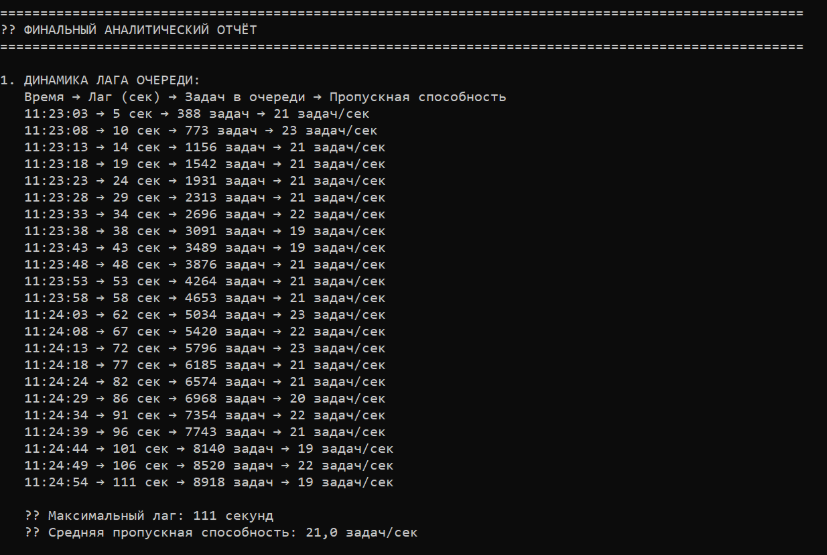
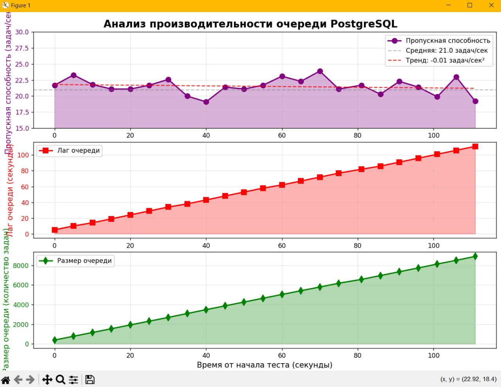
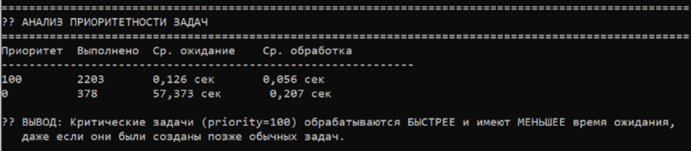
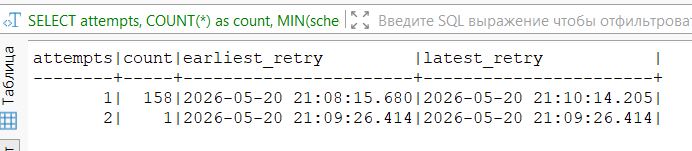
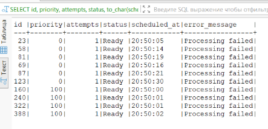
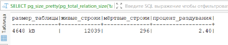
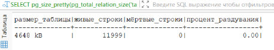

# Домашнее задание "Очередь задач на PostgreSQL"

## 1. Проектирование схемы БД

### Создана таблица `tasks`:

```sql
CREATE TABLE IF NOT EXISTS tasks (
    id BIGSERIAL PRIMARY KEY,
    task_type VARCHAR(50) NOT NULL,
    payload JSONB,
    priority INT DEFAULT 0,           -- 0 = обычная, 100 = критическая
    status VARCHAR(20) DEFAULT 'Ready', -- Ready, Running, Completed, Failed
    attempts INT DEFAULT 0,
    max_attempts INT DEFAULT 3,
    created_at TIMESTAMP DEFAULT NOW(),
    updated_at TIMESTAMP DEFAULT NOW(),
    scheduled_at TIMESTAMP DEFAULT NOW(),
    processing_started_at TIMESTAMP,
    processing_completed_at TIMESTAMP,
    error_message TEXT
);

-- Индексы для оптимальной выборки
CREATE INDEX idx_tasks_status_priority_scheduled ON tasks(status, priority DESC, scheduled_at) 
WHERE status IN ('Ready', 'Running');

CREATE INDEX idx_tasks_created_at ON tasks(created_at);
```

---

## 2. Реализация Продьюсера

### Характеристики:

- Циклическая генерация событий
- **80% обычных задач (priority=0), 20% критических (priority=100)**
- Транзакционность: вставка задачи + бизнес-логика в одной транзакции
- Отправка `NOTIFY` для пробуждения воркеров

### Код продьюсера:

```csharp
// Распределение приоритетов
bool isCritical = _random.NextDouble() < 0.2;
int priority = isCritical ? 100 : 0;

// Транзакционная вставка
await using var transaction = await connection.BeginTransactionAsync();

const string sql = @"
    INSERT INTO tasks (task_type, payload, priority, status, created_at, scheduled_at)
    VALUES (@taskType, @payload::jsonb, @priority, 'Ready', NOW(), NOW())
    RETURNING id";

await using var cmd = new NpgsqlCommand(sql, connection);
cmd.Parameters.AddWithValue("@priority", priority);
await cmd.ExecuteScalarAsync(cancellationToken);

// NOTIFY для пробуждения воркеров
await using var notifyCmd = new NpgsqlCommand("NOTIFY task_queue, 'new_task'", connection);
await notifyCmd.ExecuteNonQueryAsync(cancellationToken);

await transaction.CommitAsync(cancellationToken);
```

---

## 3. Реализация Консьюмеров (2 воркера)

### Характеристики:

- Два независимых процесса-воркера
- Конкуренция за задачи через `FOR UPDATE SKIP LOCKED`
- Перевод задачи в статус `Running` → `Completed` или `Failed`
- Имитация обработки через `Task.Delay` (50ms для критических, 200ms для обычных)

### Код захвата задачи:

```csharp
const string sql = @"
    SELECT id, task_type, payload, priority, status, attempts, created_at, scheduled_at
    FROM tasks
    WHERE status = 'Ready' AND scheduled_at <= NOW()
    ORDER BY priority DESC, scheduled_at ASC
    LIMIT 1
    FOR UPDATE SKIP LOCKED";
```

### Логика обработки:

```csharp
// Критические задачи обрабатываются быстрее (50ms vs 200ms)
var processingTime = task.Priority == 100 ? 50 : 200;
await Task.Delay(processingTime, cancellationToken);

// 5% случайных ошибок для демонстрации retry
if (_random.NextDouble() < 0.05)
    throw new Exception("Симуляция ошибки обработки");
```

---

## 4. Нагрузка и мониторинг Лага

### 4.1 Запуск продьюсера на высокую интенсивность

В `Program.cs` задана скорость 100 задач/сек:

```csharp
var producerTask = Task.Run(() => producer.StartProducingAsync(100, cts.Token));
```

### 4.2 SQL-запрос для лага очереди

```sql
SELECT 
    COALESCE(EXTRACT(EPOCH FROM (NOW() - MIN(created_at)))::INT, 0) AS lag_seconds,
    COUNT(*) AS waiting_count,
    COUNT(*) FILTER (WHERE priority = 100) AS critical_waiting,
    COUNT(*) FILTER (WHERE priority = 0) AS regular_waiting
FROM tasks
WHERE status = 'Ready' AND scheduled_at <= NOW()
```

**Что показывает:** Разницу в секундах между `NOW()` и временем создания самой старой задачи в статусе `Ready`.

### 4.3 Расчёт пропускной способности

```csharp
var elapsed = (now - _lastMetricTime).TotalSeconds;
var throughput = (completedTotal - _lastCompleted) / elapsed;
```

**Формула:** `(задач завершено сейчас - задач завершено 5 секунд назад) / 5 секунд`

---

## Результаты мониторинга



### График роста лага:



### Статистика:

| Показатель | Значение |
|------------|----------|
| **Максимальный лаг** | 111 секунд |
| **Средняя пропускная способность** | 21.0 задач/сек |
| **Всего создано задач** | ~12,000 |
| **Обработано успешно** | 2,581 |
| **Тренд пропускной способности** | -0.01 задач/сек² (стабильно) |

---

## 5. Демонстрация приоритетности задач

### Результаты анализа:



### Вывод:
> Даже если критическая задача создана позже обычной, она будет обработана первой благодаря приоритету в `ORDER BY priority DESC`.

---

## 6. Дополнительно (Retry)

### Механизм Retry:

При ошибке обработки воркер:
1. Увеличивает счётчик `attempts` на 1
2. Переносит `scheduled_at` на 5 минут в будущее
3. После 3 ошибок помечает задачу как `Failed`

### Код Retry:

```csharp
sql = @"UPDATE tasks 
        SET status = 'Ready', 
            attempts = attempts + 1, 
            scheduled_at = NOW() + INTERVAL '5 minutes',
            error_message = 'Processing failed'
        WHERE id = @taskId AND attempts < 3";
```

### Статистика Retry:



### Примеры задач с ошибками:



---

## 7. Дополнительно (LISTEN/NOTIFY)

### Реализация:

**Продьюсер отправляет уведомление:**
```csharp
await using var notifyCmd = new NpgsqlCommand("NOTIFY task_queue, 'new_task'", connection);
await notifyCmd.ExecuteNonQueryAsync();
```

**Воркер подписывается и ждёт:**
```csharp
connection.Notification += (sender, e) =>
{
    Console.WriteLine($"[Worker {_workerId}] 📢 Получено уведомление: {e.Payload}");
};

await using (var listenCmd = new NpgsqlCommand("LISTEN task_queue", connection))
{
    await listenCmd.ExecuteNonQueryAsync();
}

// Ожидание уведомления вместо постоянного опроса
await connection.WaitAsync(TimeSpan.FromSeconds(1), cancellationToken);
```

Воркеры не опрашивают БД каждую секунду, а "просыпаются" по уведомлению от продьюсера. Это снижает нагрузку на базу данных и уменьшает задержку обработки.

---

## 8. Борьба с Bloat (VACUUM)

### Состояние ДО VACUUM:



### Выполнена очистка:

```sql
VACUUM ANALYZE tasks;
```

### Состояние ПОСЛЕ VACUUM:



> **Вывод:** VACUUM ANALYZE успешно очистил мёртвые строки и обновил статистику для планировщика запросов.

---

