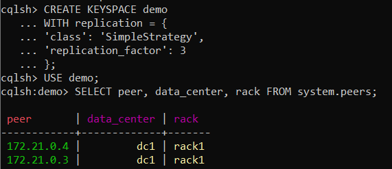
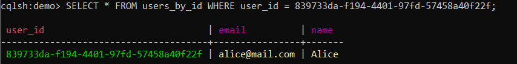
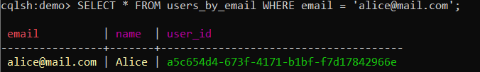
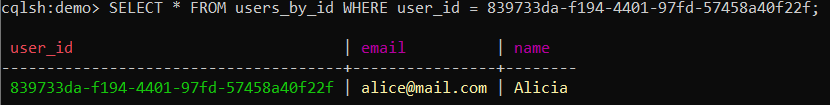
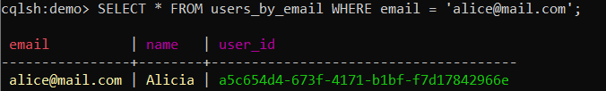
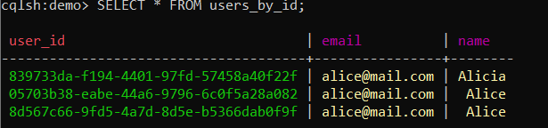
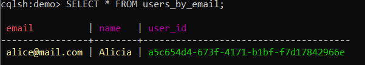
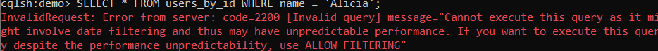
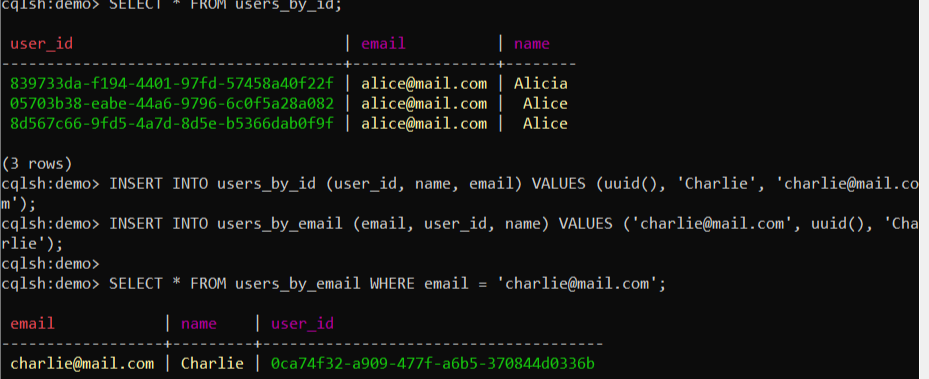

# Домашнее задание "Cassandra"

## 1. Запуск кластера Cassandra с помощью Docker Compose

Создан файл `docker-compose-cassandra.yml`.  
Запуск кластера:

```bash
docker compose -f docker-compose-cassandra.yml up -d
```
---

## 2. Создание keyspace с `replication_factor = 3` и проверка доступности всех нод

Выполнены команды:

```sql
CREATE KEYSPACE demo
WITH replication = {
  'class': 'SimpleStrategy',
  'replication_factor': 3
};

USE demo;
```

Проверка видимости двух других нод (всего их 3, но `system.peers` показывает остальные):

Результат:




Обе ноды (`cassandra2` и `cassandra3`) доступны.

---

## 3. Создание двух таблиц с одинаковыми данными, спроектированных под разные ключи

```sql
-- Таблица для поиска по user_id
CREATE TABLE users_by_id (
    user_id UUID PRIMARY KEY,
    name TEXT,
    email TEXT
);

-- Таблица для поиска по email
CREATE TABLE users_by_email (
    email TEXT PRIMARY KEY,
    user_id UUID,
    name TEXT
);
```

---

## 4. Заполнение таблиц одинаковыми данными
 
```sql
INSERT INTO users_by_id (user_id, name, email) VALUES (uuid(), 'Alice', 'alice@mail.com');
INSERT INTO users_by_email (email, user_id, name) VALUES ('alice@mail.com', uuid(), 'Alice');
INSERT INTO users_by_id (user_id, name, email) VALUES (uuid(), 'Bob', 'bob@mail.com');
INSERT INTO users_by_email (email, user_id, name) VALUES ('bob@mail.com', uuid(), 'Bob');
```

В результате в таблице `users_by_id` оказалось несколько записей с `alice@mail.com` (из-за повторных вставок), что допустимо для демонстрации.  
Таблица `users_by_email` содержит уникальные записи по ключу `email`.

---

## 5. Выполнение SELECT по ключевым полям

**SELECT из `users_by_id`** (по `user_id`):



```sql
SELECT * FROM users_by_id WHERE user_id = 839733da-f194-4401-97fd-57458a40f22f;
```

**SELECT из `users_by_email`** (по `email`):



```sql
SELECT * FROM users_by_email WHERE email = 'alice@mail.com';
```

Запросы отработали успешно.

---

## 6. Выполнение UPDATE

Обновление имени `Alice` на `Alicia` в обеих таблицах:

```sql
UPDATE users_by_id SET name = 'Alicia' WHERE user_id = 839733da-f194-4401-97fd-57458a40f22f;
UPDATE users_by_email SET name = 'Alicia' WHERE email = 'alice@mail.com';
```

Проверка:


`users_by_id` – имя изменено.


`users_by_email` – имя также изменено.

---

## 7. Выполнение DELETE

Удаление пользователя `Bob`:

```sql
DELETE FROM users_by_id WHERE user_id = 9551eaeb-568d-406e-9e54-d4f456e01be9;
DELETE FROM users_by_email WHERE email = 'bob@mail.com';
```

Проверка:


`users_by_id` – записей с `Bob` нет, остались только три записи с `alice@mail.com`.


`users_by_email` – осталась только запись с `alice@mail.com`.

---

## 8. Попытка SELECT по полю, не являющемуся ключом (ошибка)

Попробуем выбрать из `users_by_id` по полю `name`:

```sql
SELECT * FROM users_by_id WHERE name = 'Alicia';
```



---

## 9. Остановка одной ноды кластера и проверка работоспособности

В отдельном терминале остановлена нода `cassandra2`:

```bash
docker stop cassandra2
```

После этого в сессии `cqlsh` (подключенной к `cassandra1`) выполнены операции чтения и записи:

- Чтение существующих данных:

```sql
SELECT * FROM users_by_id;
```

- Вставка нового пользователя `Charlie`:

```sql
INSERT INTO users_by_id (user_id, name, email) VALUES (uuid(), 'Charlie', 'charlie@mail.com');
INSERT INTO users_by_email (email, user_id, name) VALUES ('charlie@mail.com', uuid(), 'Charlie');
```

- Проверка успешности вставки:

```sql
SELECT * FROM users_by_email WHERE email = 'charlie@mail.com';
```



Все команды выполнились без ошибок, данные доступны. Кластер продолжает работать даже при остановленной одной ноде.

