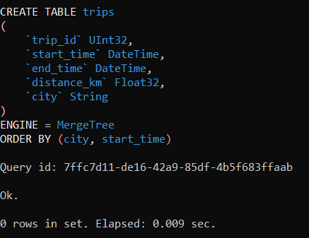
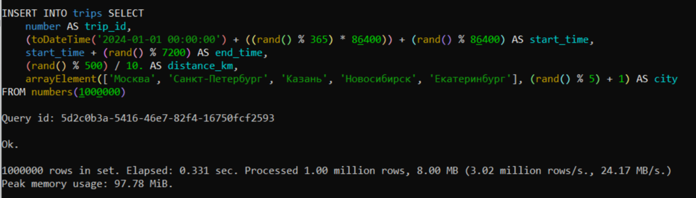
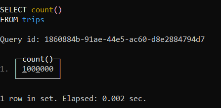
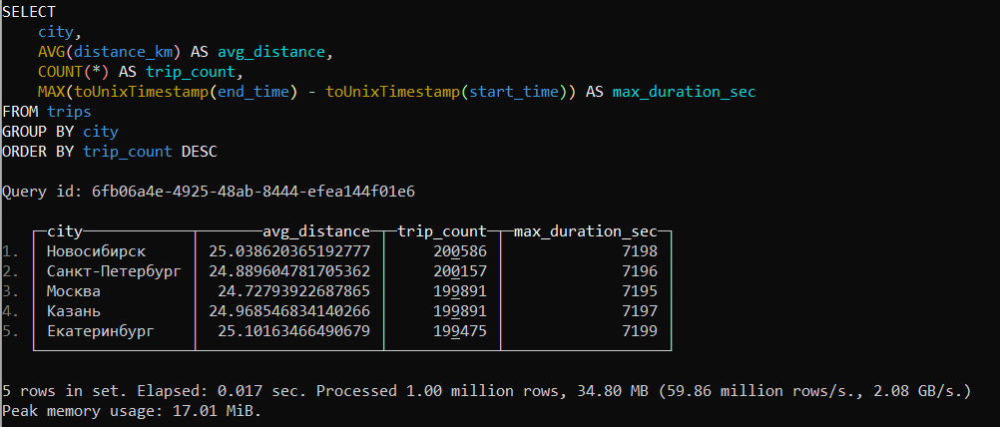

# Домашнее задание по ClickHouse

## Шаг 1. Запуск ClickHouse в Docker

### Команда для запуска контейнера:

```bash
docker run -d \
  --name clickhouse-server \
  -p 8123:8123 \
  -p 9000:9000 \
  -p 9009:9009 \
  clickhouse/clickhouse-server
```

### Подключение к клиенту:

```bash
docker exec -it clickhouse-server clickhouse-client
```


## Шаг 2. Создание таблицы

### SQL-запрос:

```sql
CREATE TABLE trips (
    trip_id UInt32,
    start_time DateTime,
    end_time DateTime,
    distance_km Float32,
    city String
) ENGINE = MergeTree()
ORDER BY (city, start_time);
```

### Результат:




## Шаг 3. Наполнение таблицы данными (1 млн строк)

### SQL-запрос:

```sql
INSERT INTO trips
SELECT
    number AS trip_id,
    toDateTime('2024-01-01 00:00:00') + rand() % 365 * 86400 + rand() % 86400 AS start_time,
    start_time + (rand() % 7200) AS end_time,
    (rand() % 500) / 10.0 AS distance_km,
    arrayElement(
        ['Москва', 'Санкт-Петербург', 'Казань', 'Новосибирск', 'Екатеринбург'],
        (rand() % 5) + 1
    ) AS city
FROM numbers(1000000);
```
### Результат:



### Проверка количества записей:

```sql
SELECT count() FROM trips;
```
### Результат:




## Шаг 4. Аналитический запрос

### Условие задачи:

Для каждого города вывести:
- среднюю дистанцию поездки (`avg_distance`)
- общее количество поездок (`trip_count`)
- максимальную длительность поездки в секундах (`max_duration_sec`)

### SQL-запрос:

```sql
SELECT
    city,
    AVG(distance_km) AS avg_distance,
    COUNT(*) AS trip_count,
    MAX(toUnixTimestamp(end_time) - toUnixTimestamp(start_time)) AS max_duration_sec
FROM trips
GROUP BY city
ORDER BY trip_count DESC;
```
### Результат:


