## 1. GIN-запросы
```sql
CREATE INDEX idx_car_specs_gin ON car USING GIN(tech_specs);
CREATE INDEX idx_order_search_gin ON client_order USING GIN(search_vector);
```

1.1. to_tsquery с AND
``` sql
EXPLAIN (ANALYZE, BUFFERS)
SELECT id, notes 
FROM client_order
WHERE search_vector @@ to_tsquery('russian', 'срочный & ремонт');
```


1.2. to_tsquery с OR
``` sql
EXPLAIN (ANALYZE, BUFFERS)
SELECT id, notes 
FROM client_order
WHERE search_vector @@ to_tsquery('russian', 'тормоза | сцепление');
```
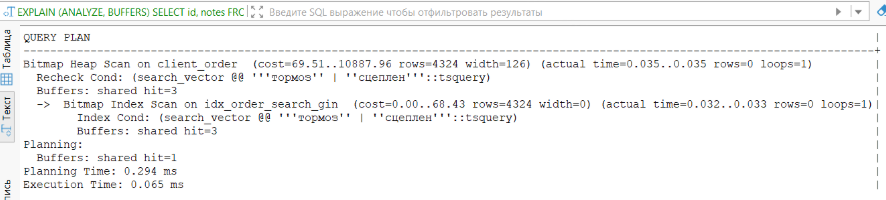

1.3. to_tsquery с NOT
``` sql
EXPLAIN (ANALYZE, BUFFERS)
SELECT id, notes 
FROM client_order
WHERE search_vector @@ to_tsquery('russian', 'замена & !гарантия');
```
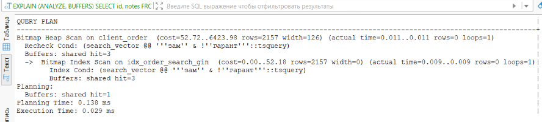

1.4. to_tsquery с фразой
``` sql
EXPLAIN (ANALYZE, BUFFERS)
SELECT id, notes 
FROM client_order
WHERE search_vector @@ to_tsquery('russian', 'проблема <-> двигатель');
```
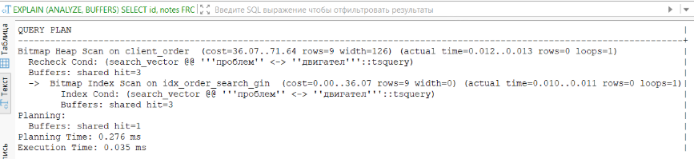

1.5. JSONB поиск
``` sql
EXPLAIN (ANALYZE, BUFFERS)
SELECT vin, tech_specs 
FROM car
WHERE tech_specs @> '{"engine": {"type": "electric"}}';
```
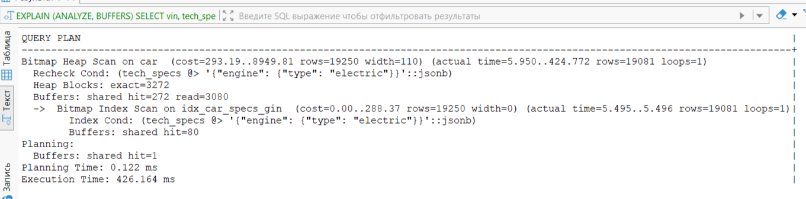

### Вывод:
Первые четыре запроса: Все выполняются менее чем за 0.1 ms, используют по 3 буфера в кеше. Оператор AND (0.035 ms) и фразовый поиск (0.035 ms) работают быстро, OR медленнее (0.065 ms), AND NOT — самый быстрый (0.029 ms). Во всех случаях строк не найдено.

Пятый запрос (JSONB): Резко отличается — время 426 ms (в 14000 раз больше), 3352 буфера (3080 чтений с диска), найдено 19081 строк.

Итог: GIN отлично подходит для полнотекстового поиска, но JSONB-запросы по вложенным структурам с большим количеством результатов требуют значительно больше ресурсов из-за физических чтений с диска.

## 2. GiST-запросы
```sql
CREATE INDEX idx_order_search_gist ON client_order USING gist(search_vector);
CREATE INDEX idx_order_completion_gist ON client_order USING gist(completion_period);
```
2.1. Диапазон - пересечение
``` sql
EXPLAIN (ANALYZE, BUFFERS)
SELECT id, created_date 
FROM client_order
WHERE completion_period && daterange('2025-05-01', '2025-06-01');
```
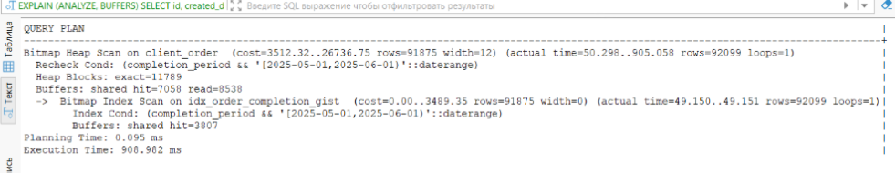

2.2. Диапазон - содержание
``` sql
EXPLAIN (ANALYZE, BUFFERS)
SELECT id, created_date 
FROM client_order
WHERE completion_period @> daterange('2025-03-15', '2025-03-20');
```
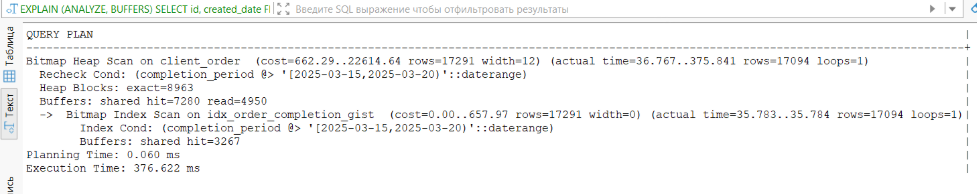

2.3. Диапазон - слева
``` sql
EXPLAIN (ANALYZE, BUFFERS)
SELECT id, created_date 
FROM client_order
WHERE completion_period << daterange('2025-01-01', '2025-02-01');
```
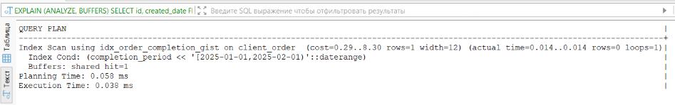

2.4. Диапазон - смежные
``` sql
EXPLAIN (ANALYZE, BUFFERS)
SELECT id, created_date, completion_date
FROM client_order
WHERE completion_period -|- daterange('2025-06-01', '2025-06-10');
```
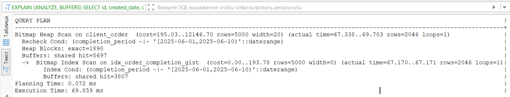

2.5. Полнотекстовый поиск на GiST 
``` sql
EXPLAIN (ANALYZE, BUFFERS)
SELECT id, notes 
FROM client_order
WHERE search_vector @@ to_tsquery('russian', 'срочный & ремонт');
```
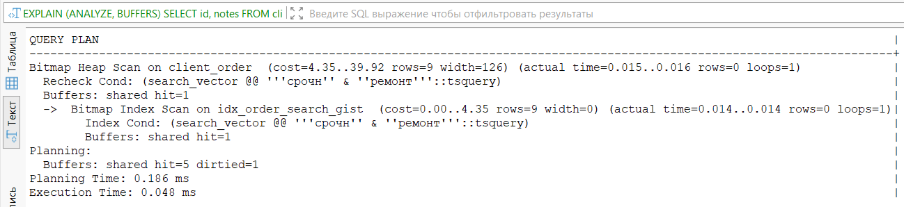


### Вывод:
GiST-1 (&&) — 908 ms, 92099 строк, 15588 буферов. Самый медленный из-за большого количества результатов.

GiST-2 (@>) — 376 ms, 17094 строк. Быстрее, так как строк меньше.

GiST-3 (<<) — 0.038 ms, строк нет. Мгновенно из-за отсутствия данных.

GiST-4 (-|-) — 69.8 ms, 2046 строк. Средняя производительность.

GiST-5 (FTS) — 0.048 ms, строк нет. Скорость как у GIN.

Производительность GiST зависит от количества найденных строк — чем больше результат, тем медленнее запрос. При пустых результатах — мгновенно. GIN стабильнее, GiST чувствителен к селективности.


## 3. Запросы на JOIN 
3.1. JOIN двух таблиц (клиенты + заказы)
``` sql
EXPLAIN (ANALYZE, BUFFERS)
SELECT c.full_name, o.created_date
FROM client c
JOIN client_order o ON c.id = o.id_client
WHERE c.id < 100;
```
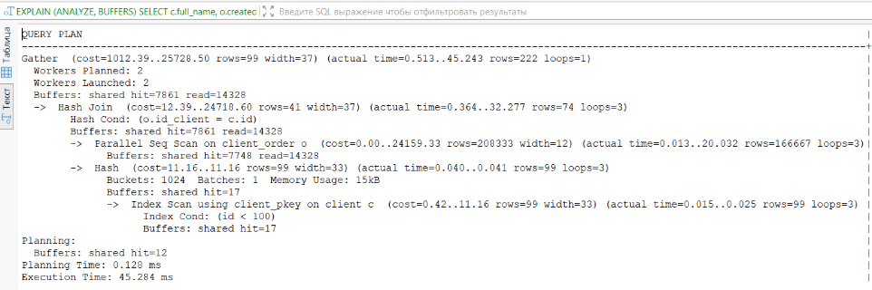

Запрос 1 использует **Parallel Hash Join** для соединения клиентов с id < 100 и их заказов. Планировщик построил хеш-таблицу по клиентам (99 строк, память 15kB) и выполнил параллельное сканирование таблицы заказов тремя воркерами. Время выполнения — 45.284 ms, прочитано 22 тысячи буферов (14328 с диска). Запрос эффективно использует параллелизацию, но отсутствие индекса на id_client в таблице заказов приводит к полному сканированию.

3.2. 
``` sql
EXPLAIN (ANALYZE, BUFFERS)
SELECT c.full_name, COUNT(o.id)
FROM client c
JOIN client_order o ON c.id = o.id_client
GROUP BY c.full_name;
```
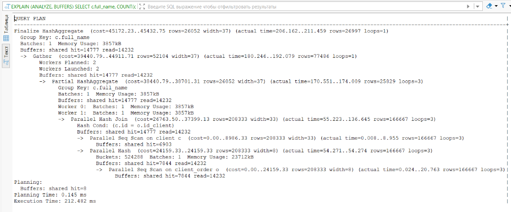

Запрос 2 выполняет группировку с подсчетом заказов по клиентам через **Parallel Hash Join** и параллельную агрегацию. Хеш-таблица строится по заказам (23712kB, 166667 строк), затем выполняется соединение с клиентами тремя воркерами. Время — 212.482 ms, все операции в памяти (Batches: 1), прочитано 29 тысяч буферов. Это оптимальный план для полного сканирования больших таблиц.

3.3. 
``` sql
EXPLAIN (ANALYZE, BUFFERS)
SELECT c.full_name, o.created_date
FROM client c
JOIN client_order o ON c.id = o.id_client
ORDER BY c.id, o.id_client;
```
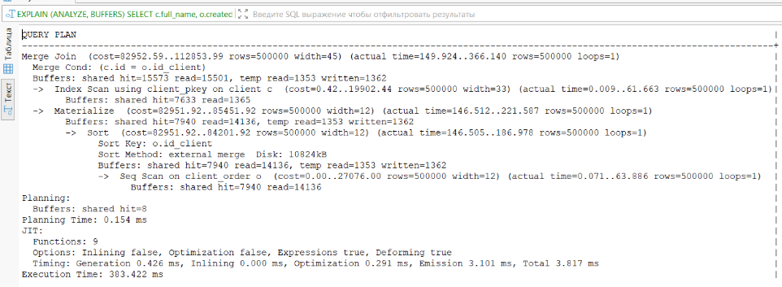

Запрос 3 реализует **Merge Join** для соединения всех клиентов и заказов с сортировкой. Клиенты читаются по индексу (уже отсортированы), заказы сортируются на диске (external merge, 10824kB). После сортировки выполняется слияние двух отсортированных потоков с материализацией промежуточных результатов. Время — 303.422 ms, самый медленный запрос из-за сортировки на диске.

3.4. 
``` sql
EXPLAIN (ANALYZE, BUFFERS)
SELECT c.full_name, cm.brand_name, o.created_date
FROM client c
JOIN client_order o ON c.id = o.id_client
JOIN car ca ON o.id_car = ca.id
JOIN car_model cm ON ca.model_id = cm.id
WHERE o.status = 'выполнен';
```
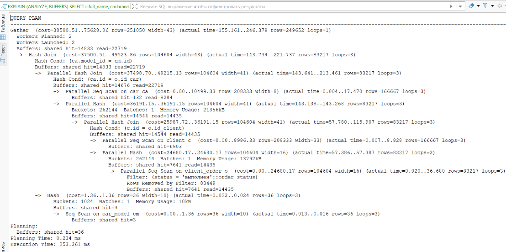

Запрос 4 использует каскад из трех **Parallel Hash Join** для соединения четырех таблиц. Сначала соединяются клиенты и заказы с фильтром по статусу (отсечено 83449 строк), затем результат соединяется с автомобилями, и наконец с моделями автомобилей. Все три уровня выполняются параллельно тремя воркерами, каждая хеш-таблица помещается в память (13792kB, 21856kB, 10kB). Время — 253.361 ms, прочитано 36 тысяч буферов.

3.5. 
``` sql
EXPLAIN (ANALYZE, BUFFERS)
SELECT cm.brand_name, cm.model_name, c.vin, c.tech_specs
FROM car c
JOIN car_model cm ON c.model_id = cm.id
WHERE c.tech_specs @> '{"engine": {"type": "electric"}}' AND c.year > 2020
LIMIT 50;
```
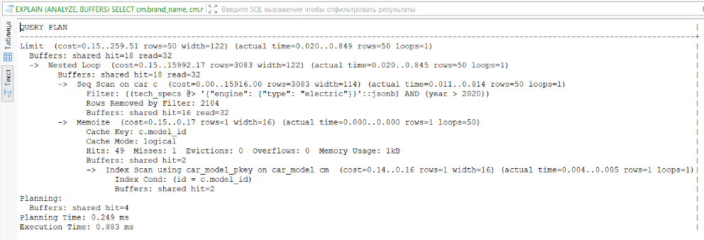

Запрос 5 использует **Nested Loop с Memoize** для поиска электрических автомобилей после 2020 года. Сначала выполняется последовательное сканирование автомобилей с фильтром по JSONB и году (отсечено 2104 строк, найдено 50). Для каждой найденной машины выполняется поиск модели: Memoize кэширует результаты по model_id. Время — 0.883 ms, лучший результат. Показывает эффективность Nested Loop при малой выборке и наличии индекса с кэшированием.

**Вывод**: В запросах представлены все три метода соединения. Parallel Hash Join доминирует в запросах 1, 2 и 4, показывая хорошую масштабируемость. Merge Join в запросе 3 оказался самым медленным из-за сортировки на диске. Nested Loop с Memoize в запросе 5 — самый быстрый благодаря эффективному кэшированию. Все планы соответствуют теории: Hash Join для больших таблиц без индексов, Merge Join требует сортировки, Nested Loop эффективен при малой выборке и наличии индекса.