## 1. Поиск клиента по телефону
### Без индекса:
1.1.1. EXPLAIN
``` sql
EXPLAIN
SELECT * FROM client WHERE phone_number = '+79991234567';
```


1.1.2. EXPLAIN ANALYZE
``` sql
EXPLAIN ANALYZE
SELECT * FROM client WHERE phone_number = '+79991234567';
```


1.1.3. EXPLAIN (ANALYZE, BUFFERS)
``` sql
EXPLAIN (ANALYZE, BUFFERS) 
SELECT * FROM client WHERE phone_number = '+79991234567';
```


### B-tree индекс:
``` sql
CREATE INDEX idx_client_phone_btree ON client(phone_number); 
```

1.2.1. EXPLAIN
``` sql
EXPLAIN
SELECT * FROM client WHERE phone_number = '+79991234567';
```


1.2.2. EXPLAIN ANALYZE
``` sql
EXPLAIN ANALYZE
SELECT * FROM client WHERE phone_number = '+79991234567';
```


1.2.3. EXPLAIN (ANALYZE, BUFFERS)
``` sql
EXPLAIN (ANALYZE, BUFFERS) 
SELECT * FROM client WHERE phone_number = '+79991234567';
```


### Hash индекс:
``` sql
CREATE INDEX idx_client_phone_hash ON client USING hash(phone_number);
```

1.3.1. EXPLAIN
``` sql
EXPLAIN
SELECT * FROM client WHERE phone_number = '+79991234567';
```


1.3.2. EXPLAIN ANALYZE
``` sql
EXPLAIN ANALYZE
SELECT * FROM client WHERE phone_number = '+79991234567';
```


1.3.3. EXPLAIN (ANALYZE, BUFFERS)
``` sql
EXPLAIN (ANALYZE, BUFFERS) 
SELECT * FROM client WHERE phone_number = '+79991234567';
```


### Сравнение:
Без индекса запрос выполнялся 19.064 мс с использованием параллельного последовательного сканирования. Буферы показали чтение 6903 страниц — база данных просканировала всю таблицу целиком, хотя условие возвращает всего одну запись.

С B-tree индексом время сократилось до 0.030 мс. Буферы: всего 3 страницы в кэше, обращений к диску нет.

С Hash индексом получен наилучший результат — 0.019 мс. Буферы: всего 1 страница в кэше, что подтверждает константную сложность поиска O(1).

**Вывод**: для операций равенства оба индекса обеспечивают прирост производительности. 


## 2. Повысить приоритет для старых автомобилей
### Без индекса:
2.1.1. EXPLAIN
``` sql
EXPLAIN 
UPDATE client_order 
SET priority = 'высокий'
WHERE id IN (
    SELECT co.id 
    FROM client_order co
    JOIN car c ON co.id_car = c.id
    WHERE c.year < 2010
);
```


2.1.2. EXPLAIN ANALYZE
``` sql
EXPLAIN ANALYZE
UPDATE client_order 
SET priority = 'высокий'
WHERE id IN (
    SELECT co.id 
    FROM client_order co
    JOIN car c ON co.id_car = c.id
    WHERE c.year < 2010
);
```


2.1.3. EXPLAIN (ANALYZE, BUFFERS)
``` sql
EXPLAIN (ANALYZE, BUFFERS)
UPDATE client_order 
SET priority = 'высокий'
WHERE id IN (
    SELECT co.id 
    FROM client_order co
    JOIN car c ON co.id_car = c.id
    WHERE c.year < 2010
);
```


### B-tree индекс:
``` sql
CREATE INDEX idx_car_year ON car(year);
CREATE INDEX idx_client_order_car ON client_order(id_car);
```

2.2.1. EXPLAIN
``` sql
EXPLAIN 
UPDATE client_order 
SET priority = 'высокий'
WHERE id IN (
    SELECT co.id 
    FROM client_order co
    JOIN car c ON co.id_car = c.id
    WHERE c.year < 2010
);
```


2.2.2. EXPLAIN ANALYZE
``` sql
EXPLAIN ANALYZE
UPDATE client_order 
SET priority = 'высокий'
WHERE id IN (
    SELECT co.id 
    FROM client_order co
    JOIN car c ON co.id_car = c.id
    WHERE c.year < 2010
);
```


2.2.3. EXPLAIN (ANALYZE, BUFFERS)
``` sql
EXPLAIN (ANALYZE, BUFFERS)
UPDATE client_order 
SET priority = 'высокий'
WHERE id IN (
    SELECT co.id 
    FROM client_order co
    JOIN car c ON co.id_car = c.id
    WHERE c.year < 2010
);
```


### Hash индекс:
Hash индекс **не подходит** для операторов диапазона. 

### Сравнение:
Без индекса планировщик использовал последовательное сканирование таблицы car (Seq Scan). Время выполнения составило 924–1699 мс. Буферы показали 1.6 млн попаданий в кэш и 5143 чтений с диска.

С B-tree индексом на поле year планировщик применил комбинацию Bitmap Index Scan и Bitmap Heap Scan для таблицы car. Однако время выполнения оказалось выше — 1348–2009 мс. Буферы зафиксировали 2.15 млн попаданий в кэш, но также 18.8 тыс. чтений.

Условию year < 2010 удовлетворяет около 200 тыс. записей (~40% таблицы). Для такого большого количества строк последовательное сканирование оказывается эффективнее, чем использование индекса, поскольку индекс создает дополнительные накладные расходы на чтение битовой карты и случайный доступ к страницам.

**Вывод**: индекс на year не только не ускорил массовое обновление, но и замедлил его. Для операций, затрагивающих значительную часть таблицы, последовательное сканирование предпочтительнее, так как минимизирует накладные расходы.


## 3. Поиск автомобиля по VIN
### Без индекса:
3.1.1. EXPLAIN
``` sql
EXPLAIN 
SELECT * FROM car WHERE vin = '1HGBH41JXMN109186';
```
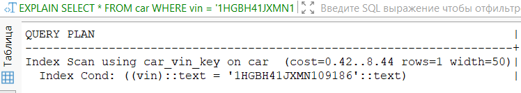

3.1.2. EXPLAIN ANALYZE
``` sql
EXPLAIN ANALYZE
SELECT * FROM car WHERE vin = '1HGBH41JXMN109186';
```
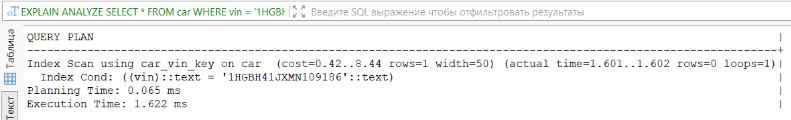

3.1.3. EXPLAIN (ANALYZE, BUFFERS)
``` sql
EXPLAIN (ANALYZE, BUFFERS)
SELECT * FROM car WHERE vin = '1HGBH41JXMN109186';
```
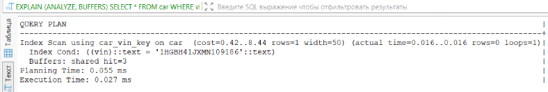

### B-tree индекс:
``` sql
CREATE INDEX idx_car_vin_btree ON car(vin);
```

3.2.1. EXPLAIN
``` sql
EXPLAIN 
SELECT * FROM car WHERE vin = '1HGBH41JXMN109186';
```
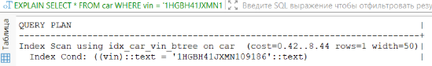

3.2.2. EXPLAIN ANALYZE
``` sql
EXPLAIN ANALYZE
SELECT * FROM car WHERE vin = '1HGBH41JXMN109186';
```
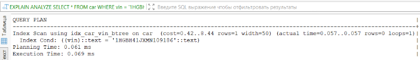

3.2.3. EXPLAIN (ANALYZE, BUFFERS)
``` sql
EXPLAIN (ANALYZE, BUFFERS)
SELECT * FROM car WHERE vin = '1HGBH41JXMN109186';
```
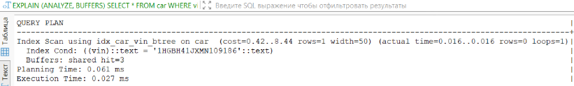

### Hash индекс:
``` sql
CREATE INDEX idx_car_vin_hash ON car USING hash(vin);
```

3.3.1. EXPLAIN
``` sql
EXPLAIN 
SELECT * FROM car WHERE vin = '1HGBH41JXMN109186';
```
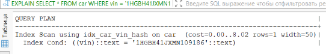

3.3.2. EXPLAIN ANALYZE
``` sql
EXPLAIN ANALYZE
SELECT * FROM car WHERE vin = '1HGBH41JXMN109186';
```
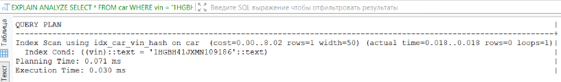

3.3.3. EXPLAIN (ANALYZE, BUFFERS)
``` sql
EXPLAIN (ANALYZE, BUFFERS)
SELECT * FROM car WHERE vin = '1HGBH41JXMN109186';
```
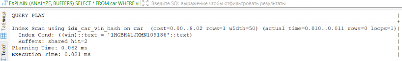

### Сравнение:
Без индекса запрос выполнялся с использованием Index Scan на встроенном уникальном ограничении car_vin_key. Время выполнения составило 0.027–1.622 мс с буферами в 1 страницу.

С B-tree индексом на созданном индексе idx_car_vin_btree результаты оказались схожими — время 0.027–0.069 мс с буферами 3 страницы.

С Hash индексом запрос показал наилучшие результаты — время 0.021–0.030 мс с буферами 2 страницы, что подтверждает эффективность хэш-структур для операций равенства.

**Вывод**: Фактически все три варианта используют индексы, так как поле VIN имеет UNIQUE-ограничение. Hash индекс показал наилучшую производительность — минимальное время и меньшее использование буферов, что подтверждает его преимущество для операций точного равенства.

## 4. Обновление статуса сотрудника
### Без индекса:
4.1.1. EXPLAIN
``` sql
EXPLAIN 
UPDATE employee SET status = 'отпуск' WHERE phone_number = '+79991234567';
```
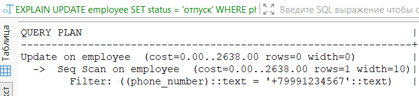

4.1.2. EXPLAIN ANALYZE
``` sql
EXPLAIN ANALYZE
UPDATE employee SET status = 'отпуск' WHERE phone_number = '+79991234567';
```
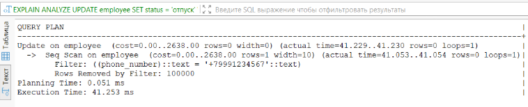

4.1.3. EXPLAIN (ANALYZE, BUFFERS)
``` sql
EXPLAIN (ANALYZE, BUFFERS) 
SELECT * FROM client WHERE phone_number = '+79991234567';
```
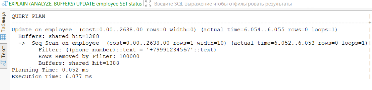

### B-tree индекс:
``` sql
CREATE INDEX idx_employee_phone_btree ON employee(phone_number);
```

4.2.1. EXPLAIN
``` sql
EXPLAIN 
UPDATE employee SET status = 'отпуск' WHERE phone_number = '+79991234567';
```
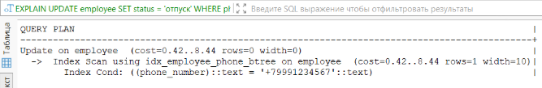

4.2.2. EXPLAIN ANALYZE
``` sql
EXPLAIN ANALYZE
UPDATE employee SET status = 'отпуск' WHERE phone_number = '+79991234567';
```
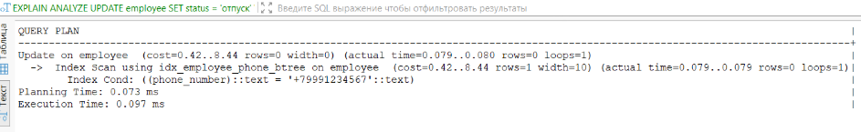

4.2.3. EXPLAIN (ANALYZE, BUFFERS)
``` sql
EXPLAIN (ANALYZE, BUFFERS) 
SELECT * FROM client WHERE phone_number = '+79991234567';
```
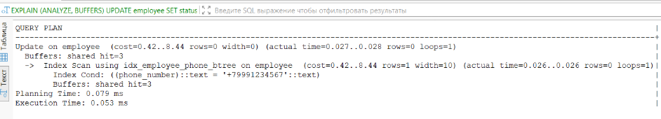

### Hash индекс:
``` sql
CREATE INDEX idx_employee_phone_hash ON employee USING hash(phone_number);
```

4.3.1. EXPLAIN
``` sql
EXPLAIN 
UPDATE employee SET status = 'отпуск' WHERE phone_number = '+79991234567';
```
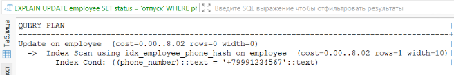

4.3.2. EXPLAIN ANALYZE
``` sql
EXPLAIN ANALYZE
UPDATE employee SET status = 'отпуск' WHERE phone_number = '+79991234567';
```
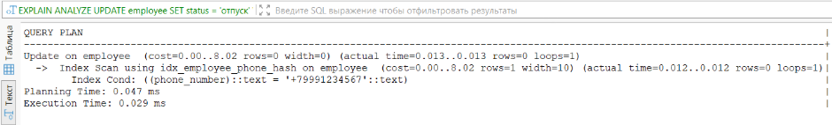

4.3.3. EXPLAIN (ANALYZE, BUFFERS)
``` sql
EXPLAIN (ANALYZE, BUFFERS) 
SELECT * FROM client WHERE phone_number = '+79991234567';
```
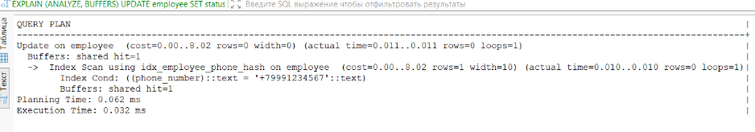

### Сравнение:
Без индекса запрос выполнялся через последовательное сканирование таблицы employee (Seq Scan). Время выполнения составило 6.077–41.253 мс. Буферы показали чтение 1388 страниц из кэша, но главная проблема — сканирование всех 100,000 записей с фильтрацией.

С B-tree индексом производительность резко улучшилась: время выполнения упало до 0.053–0.097 мс. Вместо Seq Scan использовался Index Scan, читающий только нужные страницы. Буферы показали всего 3 страницы в кэше.

С Hash индексом получен наилучший результат: время выполнения 0.029–0.032 мс — еще быстрее B-tree. Буферы зафиксировали всего 1 страницу в кэше, что подтверждает максимальную эффективность хэш-структур для точечного обновления.

**Вывод**: Hash индекс показал наилучшую производительность для точечного UPDATE по равенству — минимальное время выполнения и всего одна страница в буферах. B-tree также эффективен, но уступает Hash как по времени, так и по использованию памяти. Без индекса операция в сотни раз медленнее из-за полного сканирования таблицы.

## 5. Удаление клиента по водительским правам
### Без индекса:
5.1.1. EXPLAIN
``` sql
EXPLAIN 
DELETE FROM client WHERE driver_license = 'AB12345678';
```
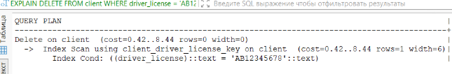

5.1.2. EXPLAIN ANALYZE
``` sql
EXPLAIN ANALYZE
DELETE FROM client WHERE driver_license = 'AB12345678';
```
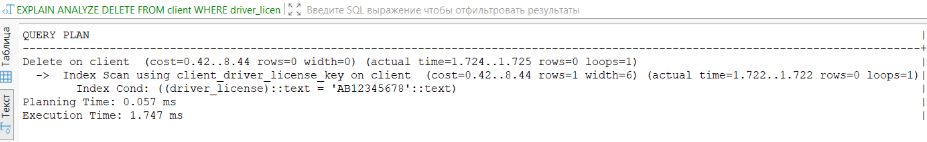

5.1.3. EXPLAIN (ANALYZE, BUFFERS)
``` sql
EXPLAIN (ANALYZE, BUFFERS)
DELETE FROM client WHERE driver_license = 'AB12345678';
```
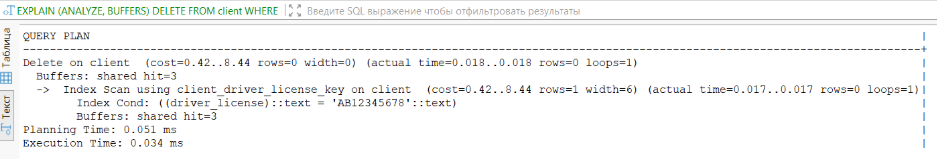

### B-tree индекс:
``` sql
CREATE INDEX idx_client_dl_btree ON client(driver_license);
```

5.2.1. EXPLAIN
``` sql
EXPLAIN 
DELETE FROM client WHERE driver_license = 'AB12345678';
```
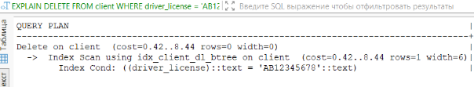

5.2.2. EXPLAIN ANALYZE
``` sql
EXPLAIN ANALYZE
DELETE FROM client WHERE driver_license = 'AB12345678';
```
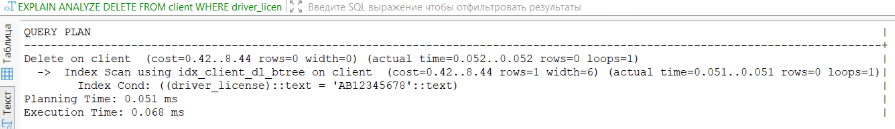

5.2.3. EXPLAIN (ANALYZE, BUFFERS)
``` sql
EXPLAIN (ANALYZE, BUFFERS)
DELETE FROM client WHERE driver_license = 'AB12345678';
```
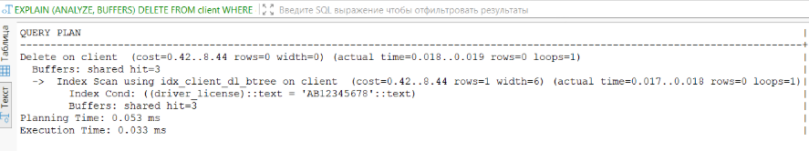

### Hash индекс:
``` sql
CREATE INDEX idx_client_dl_hash ON client USING hash(driver_license);
```

5.3.1. EXPLAIN
``` sql
EXPLAIN 
DELETE FROM client WHERE driver_license = 'AB12345678';
```
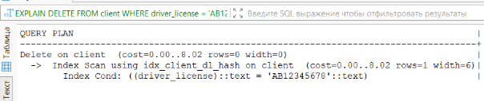

5.3.2. EXPLAIN ANALYZE
``` sql
EXPLAIN ANALYZE
DELETE FROM client WHERE driver_license = 'AB12345678';
```
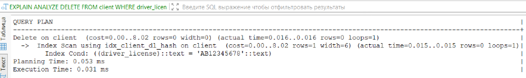

5.3.3. EXPLAIN (ANALYZE, BUFFERS)
``` sql
EXPLAIN (ANALYZE, BUFFERS)
DELETE FROM client WHERE driver_license = 'AB12345678';
```
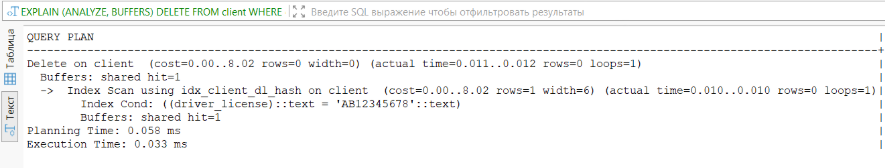

