## 1. Поиск клиента по телефону
### Без индекса:
1.1.1. EXPLAIN
``` sql
EXPLAIN
SELECT * FROM client WHERE phone_number = '+79991234567';
```
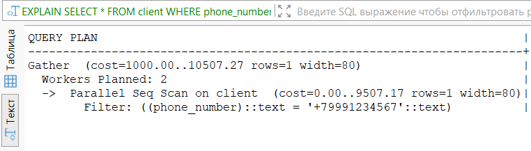

1.1.2. EXPLAIN ANALYZE
``` sql
EXPLAIN ANALYZE
SELECT * FROM client WHERE phone_number = '+79991234567';
```
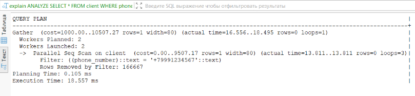

1.1.3. EXPLAIN (ANALYZE, BUFFERS)
``` sql
EXPLAIN (ANALYZE, BUFFERS) 
SELECT * FROM client WHERE phone_number = '+79991234567';
```
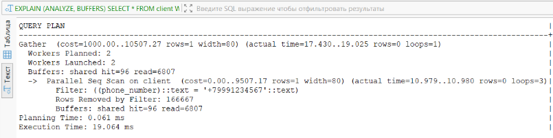

### B-tree индекс:
``` sql
CREATE INDEX idx_client_phone_btree ON client(phone_number); 
```

1.2.1. EXPLAIN
``` sql
EXPLAIN
SELECT * FROM client WHERE phone_number = '+79991234567';
```
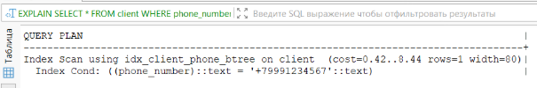

1.2.2. EXPLAIN ANALYZE
``` sql
EXPLAIN ANALYZE
SELECT * FROM client WHERE phone_number = '+79991234567';
```
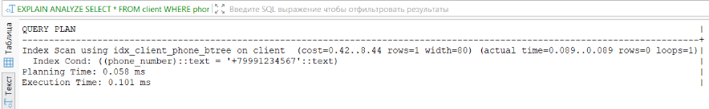

1.2.3. EXPLAIN (ANALYZE, BUFFERS)
``` sql
EXPLAIN (ANALYZE, BUFFERS) 
SELECT * FROM client WHERE phone_number = '+79991234567';
```
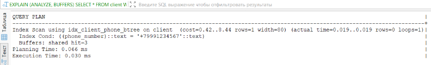

### Hash индекс:
``` sql
CREATE INDEX idx_client_phone_hash ON client USING hash(phone_number);
```

1.3.1. EXPLAIN
``` sql
EXPLAIN
SELECT * FROM client WHERE phone_number = '+79991234567';
```
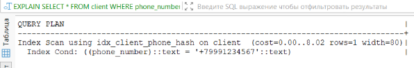

1.3.2. EXPLAIN ANALYZE
``` sql
EXPLAIN ANALYZE
SELECT * FROM client WHERE phone_number = '+79991234567';
```
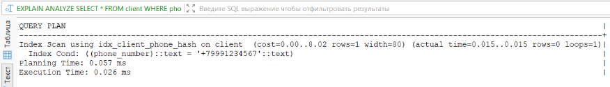

1.3.3. EXPLAIN (ANALYZE, BUFFERS)
``` sql
EXPLAIN (ANALYZE, BUFFERS) 
SELECT * FROM client WHERE phone_number = '+79991234567';
```
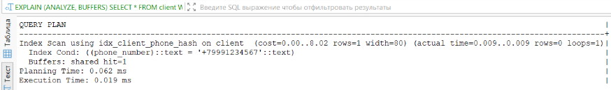

### Сравнение:
Без индекса запрос выполнялся 19.064 мс с использованием параллельного последовательного сканирования. Буферы показали чтение 6903 страниц — база данных просканировала всю таблицу целиком, хотя условие возвращает всего одну запись.

С B-tree индексом время сократилось до 0.030 мс. Буферы: всего 3 страницы в кэше, обращений к диску нет.

С Hash индексом получен наилучший результат — 0.019 мс. Буферы: всего 1 страница в кэше, что подтверждает константную сложность поиска O(1).

**Вывод**: для операций равенства оба индекса обеспечивают прирост производительности. 


## 2. Повысить приоритет для старых автомобилей
### Без индекса:
2.1.1. EXPLAIN
``` sql
EXPLAIN 
UPDATE client_order 
SET priority = 'высокий'
WHERE id IN (
    SELECT co.id 
    FROM client_order co
    JOIN car c ON co.id_car = c.id
    WHERE c.year < 2010
);
```
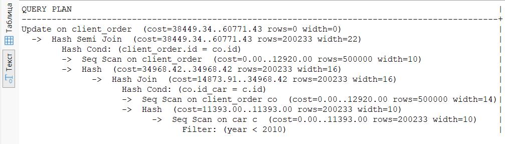

2.1.2. EXPLAIN ANALYZE
``` sql
EXPLAIN ANALYZE
UPDATE client_order 
SET priority = 'высокий'
WHERE id IN (
    SELECT co.id 
    FROM client_order co
    JOIN car c ON co.id_car = c.id
    WHERE c.year < 2010
);
```
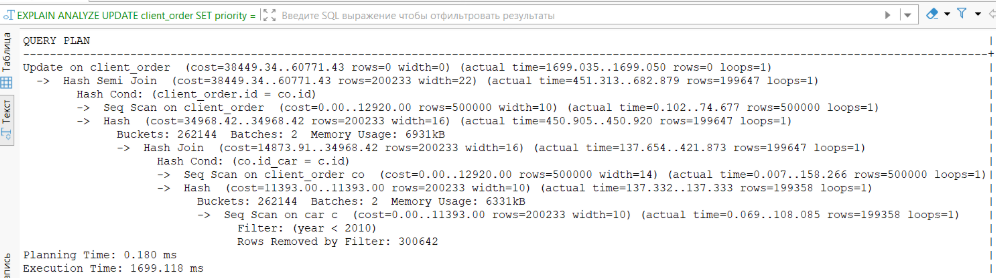

2.1.3. EXPLAIN (ANALYZE, BUFFERS)
``` sql
EXPLAIN (ANALYZE, BUFFERS)
UPDATE client_order 
SET priority = 'высокий'
WHERE id IN (
    SELECT co.id 
    FROM client_order co
    JOIN car c ON co.id_car = c.id
    WHERE c.year < 2010
);
```
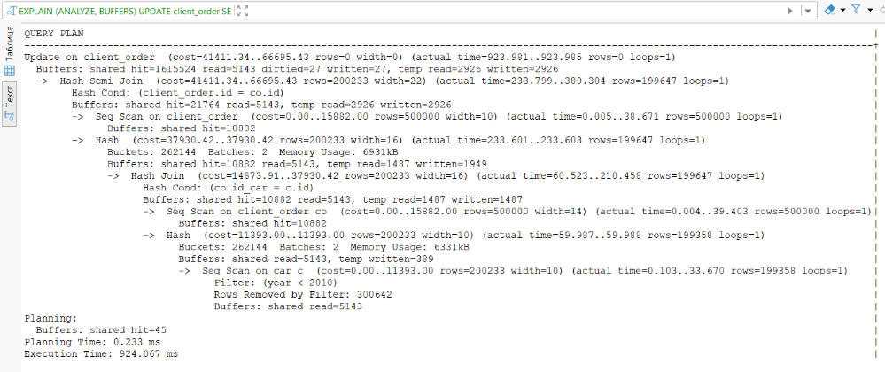

### B-tree индекс:
``` sql
CREATE INDEX idx_car_year ON car(year);
CREATE INDEX idx_client_order_car ON client_order(id_car);
```

2.2.1. EXPLAIN
``` sql
EXPLAIN 
UPDATE client_order 
SET priority = 'высокий'
WHERE id IN (
    SELECT co.id 
    FROM client_order co
    JOIN car c ON co.id_car = c.id
    WHERE c.year < 2010
);
```
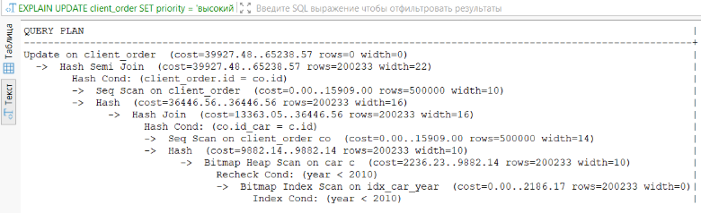

2.2.2. EXPLAIN ANALYZE
``` sql
EXPLAIN ANALYZE
UPDATE client_order 
SET priority = 'высокий'
WHERE id IN (
    SELECT co.id 
    FROM client_order co
    JOIN car c ON co.id_car = c.id
    WHERE c.year < 2010
);
```
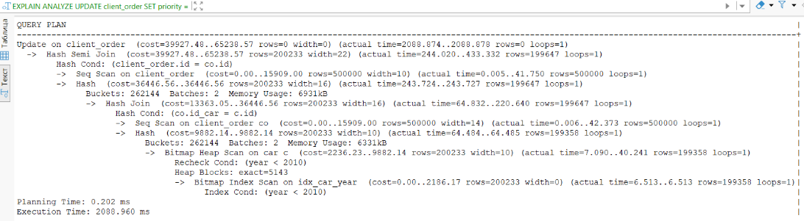

2.2.3. EXPLAIN (ANALYZE, BUFFERS)
``` sql
EXPLAIN (ANALYZE, BUFFERS)
UPDATE client_order 
SET priority = 'высокий'
WHERE id IN (
    SELECT co.id 
    FROM client_order co
    JOIN car c ON co.id_car = c.id
    WHERE c.year < 2010
);
```
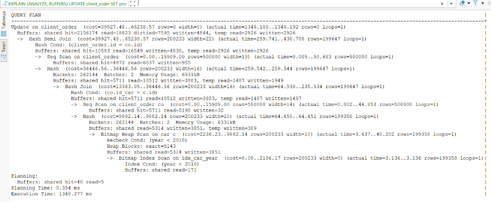

### Hash индекс:
Hash индекс **не подходит** для операторов диапазона. 

### Сравнение:
Без индекса планировщик использовал последовательное сканирование таблицы car (Seq Scan). Время выполнения составило 924–1699 мс. Буферы показали 1.6 млн попаданий в кэш и 5143 чтений с диска.

С B-tree индексом на поле year планировщик применил комбинацию Bitmap Index Scan и Bitmap Heap Scan для таблицы car. Однако время выполнения оказалось выше — 1348–2009 мс. Буферы зафиксировали 2.15 млн попаданий в кэш, но также 18.8 тыс. чтений.

Условию year < 2010 удовлетворяет около 200 тыс. записей (~40% таблицы). Для такого большого количества строк последовательное сканирование оказывается эффективнее, чем использование индекса, поскольку индекс создает дополнительные накладные расходы на чтение битовой карты и случайный доступ к страницам.

**Вывод**: индекс на year не только не ускорил массовое обновление, но и замедлил его. Для операций, затрагивающих значительную часть таблицы, последовательное сканирование предпочтительнее, так как минимизирует накладные расходы.

