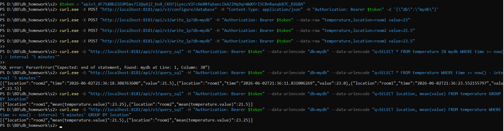

# Домашнее задание "InfluxDB"

## 0. Запуск Docker Compose

Использовался файл `docker-compose-influx.yml` со следующим содержимым:

```yaml
services:
  influxdb3:
    image: influxdb:3-core
    container_name: influxdb3-core
    command:
      - influxdb3
      - serve
      - --node-id=node0
      - --object-store=file
      - --data-dir=/var/lib/influxdb3/data
    ports:
      - "8181:8181"
    volumes:
      - ./influxdb3-data:/var/lib/influxdb3/data
    restart: unless-stopped

  explorer:
    image: influxdata/influxdb3-ui:1.7.0
    container_name: influxdb3-explorer
    depends_on:
      - influxdb3
    command: ["--mode=admin"]
    ports:
      - "8888:8080"
    volumes:
      - ./explorer-db:/db
      - ./config:/app-root/config:ro
    environment:
      SESSION_SECRET_KEY: ${SESSION_SECRET_KEY:-changeme123456789012345678901234}
    restart: unless-stopped
```

Команда запуска:

```powershell
docker compose -f docker-compose-influx.yml up -d
```
---

## 1. Получение admin-токена

```powershell
docker exec -it influxdb3-core influxdb3 create token --admin
```

**Вывод**:

```
New token created successfully!

Token: apiv3_4F7SX0b2lEUMlms7I2Qq4jZ_hnX_CKH7jiyeccVlFcHe0Rfq6aocIkAZIMq9qrWWXfrl5CBnRaeqk87C_D2G8A
```

Токен сохранён в переменную `$token` для дальнейшего использования.

---

## 2. Создание bucket `mydb`

```powershell
$token = "apiv3_4F7SX0b2lEUMlms7I2Qq4jZ_hnX_CKH7jiyeccVlFcHe0Rfq6aocIkAZIMq9qrWWXfrl5CBnRaeqk87C_D2G8A"
curl.exe -X POST "http://localhost:8181/api/v3/configure/database" -H "Content-Type: application/json" -H "Authorization: Bearer $token" -d '{\"db\":\"mydb\"}'
```

**Результат**: пустой ответ `{}` — bucket создан.

---

## 3. Вставка тестовых данных 

Вставлены три точки в measurement `temperature`:

```powershell
curl.exe -X POST "http://localhost:8181/api/v3/write_lp?db=mydb" -H "Authorization: Bearer $token" --data-raw "temperature,location=room1 value=23"
curl.exe -X POST "http://localhost:8181/api/v3/write_lp?db=mydb" -H "Authorization: Bearer $token" --data-raw "temperature,location=room2 value=21.5"
curl.exe -X POST "http://localhost:8181/api/v3/write_lp?db=mydb" -H "Authorization: Bearer $token" --data-raw "temperature,location=room1 value=23.5"
```

---

## 4. Чтение данных за последние 5 минут

```powershell
curl.exe -G "http://localhost:8181/api/v3/query_sql" -H "Authorization: Bearer $token" --data-urlencode "db=mydb" --data-urlencode "q=SELECT * FROM temperature WHERE time >= now() - interval '5 minutes'"
```

**Результат** (JSON):

```json
[
  {"location":"room2","time":"2026-06-02T21:36:18.308763600","value":21.5},
  {"location":"room1","time":"2026-06-02T21:36:11.831006269","value":23.0},
  {"location":"room1","time":"2026-06-02T21:36:23.552155797","value":23.5}
]
```

---

## 5. Группировка по тегу `location` со средним значением

**За всё время**:

```powershell
curl.exe -G "http://localhost:8181/api/v3/query_sql" -H "Authorization: Bearer $token" --data-urlencode "db=mydb" --data-urlencode "q=SELECT location, mean(value) FROM temperature GROUP BY location"
```

**Результат**:

```json
[
  {"location":"room1","mean(temperature.value)":23.25},
  {"location":"room2","mean(temperature.value)":21.5}
]
```

**За последние 5 минут** (аналогично, так как все данные свежие):

```powershell
curl.exe -G "http://localhost:8181/api/v3/query_sql" -H "Authorization: Bearer $token" --data-urlencode "db=mydb" --data-urlencode "q=SELECT location, mean(value) FROM temperature WHERE time >= now() - interval '5 minutes' GROUP BY location"
```

**Результат**:

```json
[
  {"location":"room2","mean(temperature.value)":21.5},
  {"location":"room1","mean(temperature.value)":23.25}
]
```





