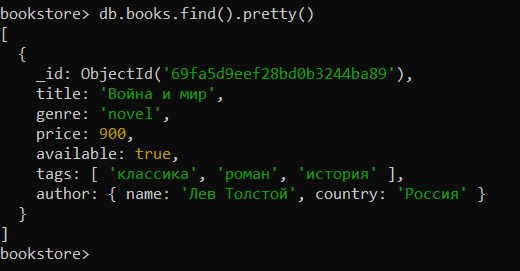
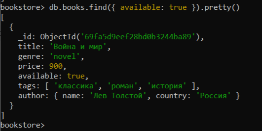
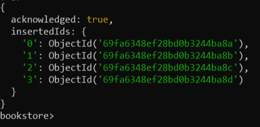
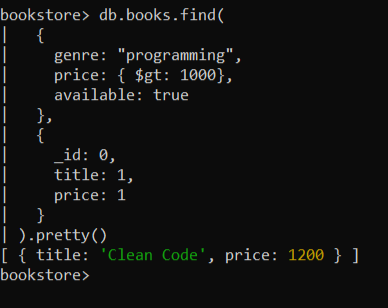

# Домашнее задание по MongoDB

### 1. Запуск окружения

Запущен Docker-контейнер с MongoDB:
```bash
docker run -d -p 27017:27017 mongo
```

### 2. Подключение к MongoDB Shell

Подключение к контейнеру и запуск mongosh:
```bash
docker exec -it my_mongo mongosh
```

Переключение на базу данных `bookstore`:
```javascript
use bookstore
```

### 3. Задание 1: Создание коллекции

Добавлена первая книга в коллекцию `books`:

```javascript
db.books.insertOne({
  title: "Война и мир",
  genre: "novel",
  price: 900,
  available: true,
  tags: ["классика", "роман", "история"],
  author: {
    name: "Лев Толстой",
    country: "Россия"
  }
})
```

**Результат:**



### 4. Задание 2: Простой поиск по одному условию

```javascript
db.books.find({ available: true }).pretty()
```
**Результат:**



### 5. Задание 3: Добавление нескольких документов

Добавлено 4 книги с помощью `insertMany()`:

```javascript
db.books.insertMany([
  {
    title: "Clean Code",
    genre: "programming",
    price: 1200,
    available: true,
    tags: ["разработка", "чистый код"],
    author: {
      name: "Robert Martin",
      country: "USA"
    }
  },
  {
    title: "Мастер и Маргарита",
    genre: "novel",
    price: 650,
    available: true,
    tags: ["мистика", "классика", "роман"],
    author: {
      name: "Михаил Булгаков",
      country: "Россия"
    }
  },
  {
    title: "Refactoring",
    genre: "programming",
    price: 4800,
    available: false,
    tags: ["рефакторинг"],
    author: {
      name: "Martin Fowler",
      country: "UK"
    }
  },
  {
    title: "Идиот",
    genre: "novel",
    price: 590,
    available: false,
    tags: ["классика", "роман"],
    author: {
      name: "Фёдор Достоевский",
      country: "Россия"
    }
  }
])
```

**Результат:**



### 6. Задание 4: Запрос посложнее

Поиск книг жанра `programming`, дороже заданной суммы, в наличии, только название и цена:
```javascript
db.books.find(
  {
    genre: "programming",
    price: { $gt: 1000 },
    available: true
  },
  {
    _id: 0,
    title: 1,
    price: 1
  }
).pretty()
```

**Результат:**


