## 1. Смоделировать обновление данных и посмотреть на параметры xmin, xmax, ctid, t_infomask
Посмотрим несколько записей в таблице employee:
```sql
SELECT 
    ctid,
    xmin::text,
    xmax::text,
    id,
    full_name,
    status
FROM employee 
LIMIT 3;
```
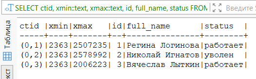

Обновляем сотрудника и возвращаем системные поля:
```sql
UPDATE employee 
SET status = 'отпуск' 
WHERE id = 1 
RETURNING 
    ctid,
    xmin::text,
    xmax::text,
    id,
    full_name,
    status;
```

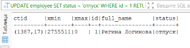

Смотрим на t_infomask через pageinspect:
```sql
CREATE EXTENSION IF NOT EXISTS pageinspect;

-- Находим физическое расположение обновленной строки
SELECT ctid 
FROM employee 
WHERE id = 1;

SELECT 
    lp,
    t_infomask::integer,
    to_hex(t_infomask) AS t_infomask_hex
FROM heap_page_items(get_raw_page('employee', 0))
WHERE lp = 17;  
```

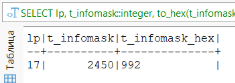

### Вывод:
Начальное состояние показало, что все записи были созданы одной транзакцией.

После выполнения UPDATE для сотрудника с id = 1 наблюдались следующие изменения:
- [x] ctid изменился с (0,1) на (1387,17), что демонстрирует физическое перемещение строки на новую страницу при обновлении
- [x] xmin стал равен 27555110 — идентификатору транзакции, выполнившей обновление
- [x] xmax установился в 0, пометив новую версию как актуальную

Анализ t_infomask показал значение 2450 (0x992), которое включает флаги HEAP_HASVARWIDTH (наличие полей переменной длины).


## 2. Понять что хранится в t_infomask
**t_infomask** — это битовая маска (2 байта) в заголовке кортежа (версии строки), которая хранит **флаги состояния данной версии строки**. Эти флаги определяют, как PostgreSQL должен интерпретировать эту версию и видна ли она текущим транзакциям.

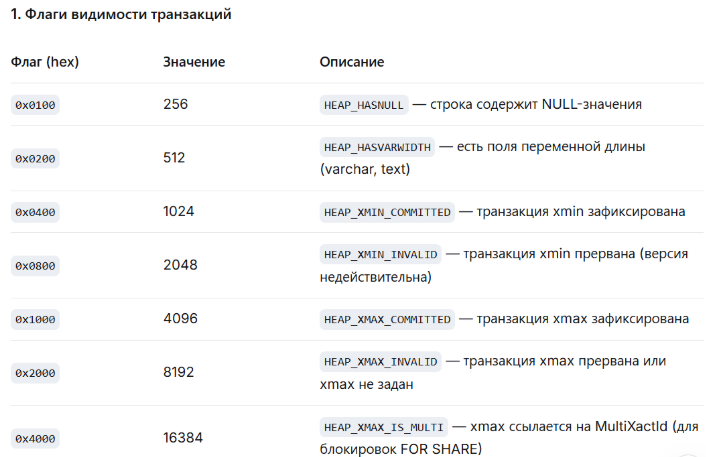
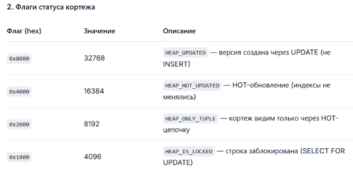


## 3. Посмотреть на параметры из п1 в разных транзакциях
3.1. Чтение во время незавершённого обновления
``` sql
-- Сессия 1
BEGIN;

-- Запоминаем ID текущей транзакции
SELECT txid_current() AS transaction_id_1;

-- Обновляем сотрудника с id = 5
UPDATE employee 
SET status = 'отпуск' 
WHERE id = 5 
RETURNING id, full_name, status, ctid, xmin::text, xmax::text;

-- Запоминаем новый ctid 
SELECT ctid AS new_ctid FROM employee WHERE id = 5;

-- Сессия 2
BEGIN;

-- Читаем того же сотрудника
SELECT 
    id,
    full_name,
    status,
    ctid,
    xmin::text,
    xmax::text
FROM employee 
WHERE id = 5;

-- Сессия 1
COMMIT;

-- Сессия 2
-- Снова читаем того же сотрудника 
SELECT 
    id,
    full_name,
    status,
    ctid,
    xmin::text,
    xmax::text
FROM employee 
WHERE id = 5;

COMMIT;
```

**Шаг 1:** Начало транзакции 1 
ID транзакции 1 = 2755514

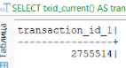

**Шаг 2:** После UPDATE в сессии 1
- ctid изменился на (0,75) — новая версия на той же странице
- xmin = 2755514 (ID транзакции 1)
- xmax = 0 (это актуальная версия)

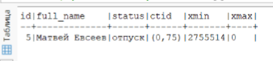
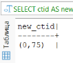

**Шаг 3:** Сессия 2 читает во время транзакции 1 
- status = 'отпуск' — старое значение
- ctid = (0,5) — это старая версия строки
- xmin = 2363 — транзакция, создавшая старую версию
- xmax = 2755514 — ID транзакции 1, которая сейчас обновляет строку

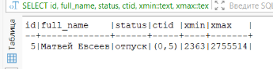

**Шаг 4:** Сессия 2 после COMMIT в сессии 1 
- status = 'отпуск' — новое значение
- ctid = (0,75) — новая версия
- xmin = 2755514 — ID транзакции 1
- xmax = 0 — актуальная версия

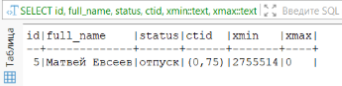


## 4. Смоделировать дедлок, описать результаты
```sql
-- Сессия 1
BEGIN;

-- Блокируем и обновляем сотрудника с id = 1
UPDATE employee 
SET status = 'отпуск' 
WHERE id = 1 
RETURNING id, full_name, status;

-- Сессия 2
BEGIN;

-- Блокируем и обновляем сотрудника с id = 2
UPDATE employee 
SET status = 'уволен' 
WHERE id = 2 
RETURNING id, full_name, status;

-- Сессия 1
-- Пытаемся обновить сотрудника с id = 2 (который заблокирован сессией 2)
UPDATE employee 
SET status = 'работает' 
WHERE id = 2 
RETURNING id, full_name, status;

-- Сессия 2
-- Пытаемся обновить сотрудника с id = 1 (который заблокирован сессией 1)
UPDATE employee 
SET status = 'работает' 
WHERE id = 1 
RETURNING id, full_name, status;
```

**Шаг 1:**
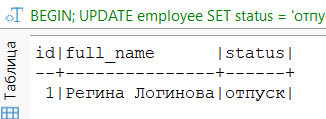

Сессия 1 начала транзакцию, обновила сотрудника с id = 1, установив статус 'отпуск'. Команда RETURNING показала результат обновления. Транзакция ещё не закрыта (COMMIT не сделан), поэтому строка с id=1 заблокирована.

**Шаг 2:**
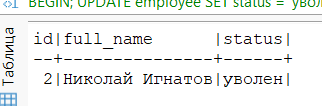

Сессия 2 начала транзакцию, обновила сотрудника с id = 2, установив статус 'уволен'. Команда RETURNING показала результат. Транзакция 2 тоже не закрыта, строка с id=2 заблокирована.

**Шаг 3:**


Сессия 1 попыталась выполнить второй запрос. Этот запрос повис.
Причина: строка с id=2 заблокирована сессией 2 (которая ещё не завершилась)

**Шаг 4:**
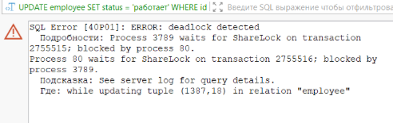

Сессия 2 попыталась выполнить свой второй запрос. В этот момент PostgreSQL обнаружил взаимоблокировку.

**Как сработал MVCC:**
- Каждая транзакция заблокировала свою первую строку через xmax
- При попытке заблокировать вторую строку образовался цикл ожидания