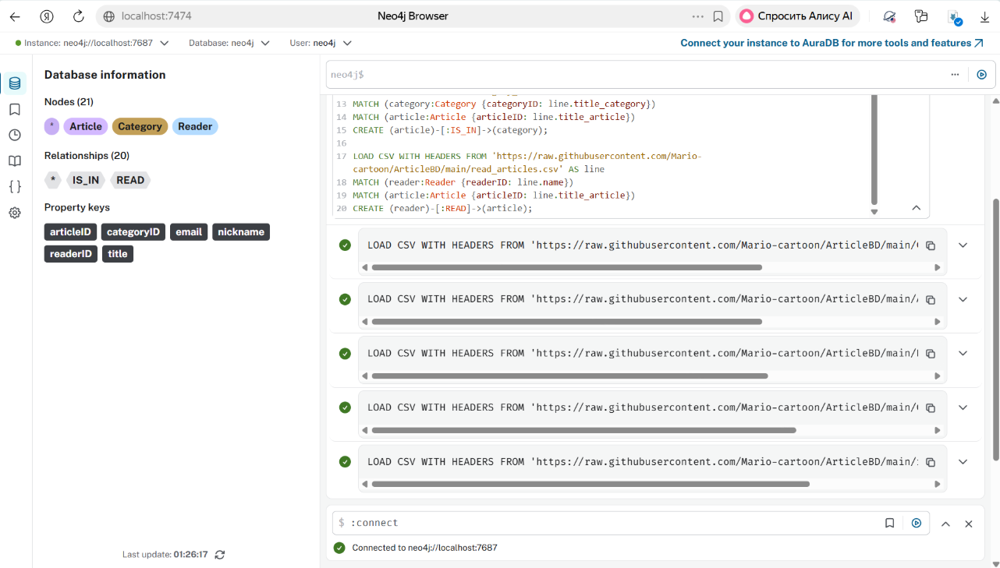
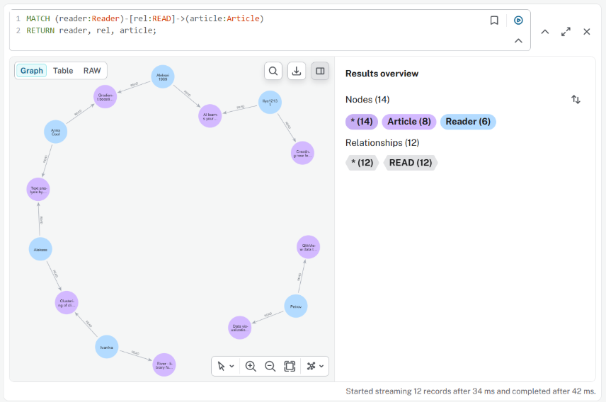
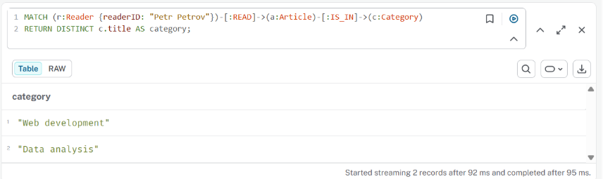
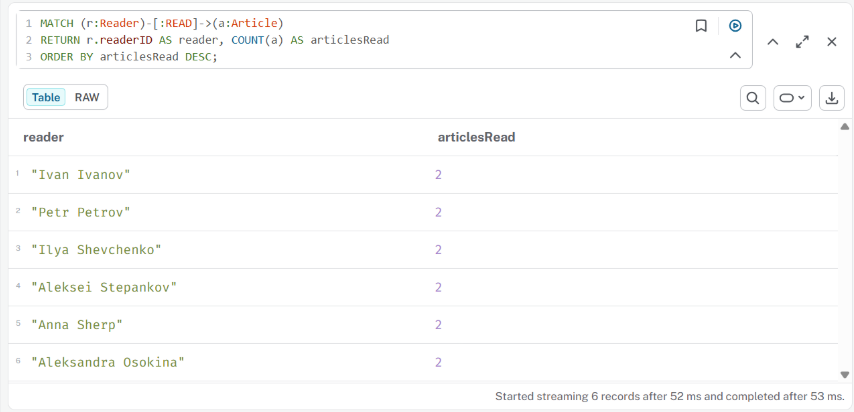
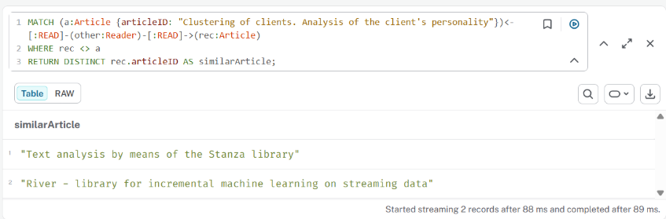
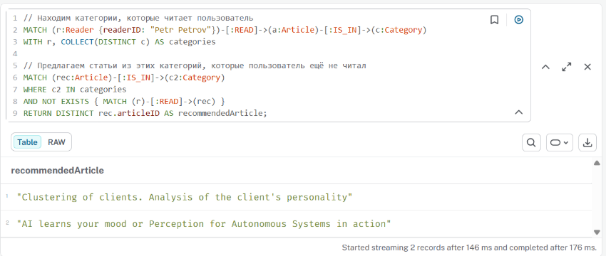

# Домашнее задание "Neo4j"

## Подготовка

### 1. Запуск Neo4j контейнера

Использован Docker Compose с образом `neo4j:5`.

После запуска Neo4j Browser доступен по адресу `http://localhost:7474`.

### 2. Импорт датасета

Выполнены команды `LOAD CSV` для импорта узлов и связей из файлов:

- `Category.csv` → узлы `Category`
- `Articles.csv` → узлы `Article`
- `Reader.csv` → узлы `Reader`
- `Category_articles.csv` → связи `IS_IN`
- `read_articles.csv` → связи `READ`



На скриншоте видно итоговое количество узлов (21) и связей (20), а также список меток и типов связей.

## Вставка новых данных

### 1. Добавление категории

```cypher
CREATE (c:Category {categoryID: "NewCategory", title: "Новая категория"});
```

### 2. Добавление статьи

```cypher
CREATE (a:Article {articleID: "NewArticle", title: "Название новой статьи"});
```

### 3. Добавление читателя и связей с 3–5 статьями

```cypher
CREATE (r:Reader {readerID: "IvanIvanov", nickname: "ivan123", email: "ivan@example.com"});

MATCH (a1:Article {articleID: "Clustering of clients. Analysis of the client's personality"})
MATCH (a2:Article {articleID: "Introduction to Machine Learning"})
MATCH (a3:Article {articleID: "Web Development Basics"})
MATCH (a4:Article {articleID: "Data Visualization with Python"})
CREATE (r)-[:READ]->(a1),
       (r)-[:READ]->(a2),
       (r)-[:READ]->(a3),
       (r)-[:READ]->(a4);
```

## Запросы и результаты

### 1. Отображение всех пользователей, статей и связей между ними

```cypher
MATCH (reader:Reader)-[rel:READ]->(article:Article)
RETURN reader, rel, article;
```



В графовом представлении отображены 6 узлов `Reader`, 8 узлов `Article` и 12 отношений `READ`.

### 2. Выбор пользователя и поиск категорий, которые он читает

Пользователь: `Petr Petrov`

```cypher
MATCH (r:Reader {readerID: "Petr Petrov"})-[:READ]->(a:Article)-[:IS_IN]->(c:Category)
RETURN DISTINCT c.title AS category;
```



Пользователь читает статьи из категорий: **Web development** и **Data analysis**.

### 3. Поиск самых активных читателей (кто прочитал больше всего статей)

```cypher
MATCH (r:Reader)-[:READ]->(a:Article)
RETURN r.readerID AS reader, COUNT(a) AS articlesRead
ORDER BY articlesRead DESC;
```



Все читатели в датасете прочитали по 2 статьи.

### 4. Выбор статьи и поиск похожих (читаемых теми же пользователями)

Статья: `"Clustering of clients. Analysis of the client's personality"`

```cypher
MATCH (a:Article {articleID: "Clustering of clients. Analysis of the client's personality"})<-[:READ]-(other:Reader)-[:READ]-(rec:Article)
WHERE rec <> a
RETURN DISTINCT rec.articleID AS similarArticle;
```



Найдены две похожие статьи:
- `"Text analysis by means of the Stanza library"`
- `"River - library for incremental machine learning on streaming data"`

### 5. Рекомендации по категориям для пользователя

**Пользователь:** `Petr Petrov`

**Шаг 1:** найти категории, которые читает пользователь  
**Шаг 2:** предложить статьи из этих категорий, которые он ещё не читал

```cypher
MATCH (r:Reader {readerID: "Petr Petrov"})-[:READ]->(a:Article)-[:IS_IN]->(c:Category)
WITH r, COLLECT(DISTINCT c) AS categories

MATCH (rec:Article)-[:IS_IN]->(c2:Category)
WHERE c2 IN categories
AND NOT EXISTS { MATCH (r)-[:READ]->(rec) }
RETURN DISTINCT rec.articleID AS recommendedArticle;
```



Рекомендованы статьи:
- `"Clustering of clients. Analysis of the client's personality"`
- `"AI learns your mood or Perception for Autonomous Systems in action"`


