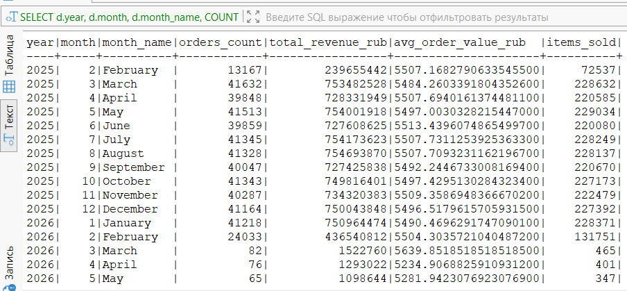
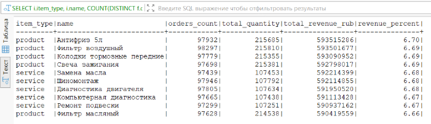
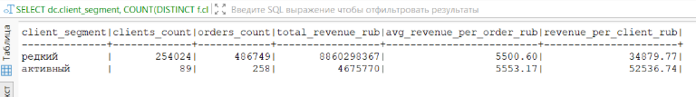
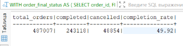

# Домашнее задание "OLAP-модели для автосервиса"

## Пункт 1. Выбор аналитических вопросов

Определяем ключевые бизнес-вопросы, на которые должна отвечать наша аналитическая модель. Это помогает правильно спроектировать факты и измерения.

**Выбранные вопросы для автосервиса:**

| № | Вопрос | Бизнес-ценность |
|---|--------|----------------|
| **1** | **Динамика выручки по месяцам** — как меняется доход автосервиса во времени? | Планирование загрузки, оценка сезонности, прогнозирование |
| **2** | **Какие услуги и товары приносят больше всего выручки?** (самые популярные сущности) | Оптимизация ассортимента, маркетинг, управление запасами |
| **3** | **Сколько действий совершают пользователи и какая конверсия между статусами заказов?** | Оценка качества работы, клиентская аналитика, выявление проблемных зон |

---

## Пункт 2. Определение главного факта

Выбираем центральную таблицу фактов, которая будет хранить количественные показатели для анализа.

**Выбранный факт:** `fact_sales` (продажи)

Продажи являются центральным событием бизнеса автосервиса. Каждая продажа (товара или услуги) имеет количественные показатели (цена, количество), привязана к клиенту, сотруднику, локации и времени.

```sql
-- Создаём схему для аналитики
CREATE SCHEMA IF NOT EXISTS olap;

-- Создаём таблицу фактов
CREATE TABLE olap.fact_sales (
    sale_id BIGSERIAL PRIMARY KEY,
    date_id INTEGER NOT NULL,        -- дата создания заказа
    client_id INTEGER NOT NULL,      -- клиент
    item_id INTEGER NOT NULL,        -- товар/услуга
    location_id INTEGER NOT NULL,    -- локация
    employee_id INTEGER,             -- сотрудник
    
  	-- Атрибуты заказа
    order_id INTEGER NOT NULL,       -- ID исходного заказа
    status VARCHAR(20),              -- статус заказа
    priority VARCHAR(20),            -- приоритет заказа
    
    -- Факты (числовые показатели)
    quantity INTEGER NOT NULL,       -- количество
    unit_price INTEGER NOT NULL,     -- цена за единицу (копейки)
    total_amount INTEGER NOT NULL,   -- итого по позиции (копейки)
    
    -- Метаданные
    created_date TIMESTAMP
);
```

---

## Пункт 3. Определение зерна факта

**1 строка = 1 позиция заказа** (один товар ИЛИ одна услуга)

В одном заказе может быть несколько товаров и услуг. У каждой позиции своя цена и количество. Такая детализация позволяет агрегировать данные до любого нужного уровня (заказ, клиент, день, категория).

---

## Пункт 4. Создание измерений

Создаём размерные таблицы, которые будут описывать факты. Измерения нужны для фильтрации, группировки и "срезов" данных.

### 4.1 Измерение dim_date (дата)

```sql
CREATE TABLE olap.dim_date (
    date_id INTEGER PRIMARY KEY,      -- формат: YYYYMMDD
    full_date DATE NOT NULL,
    year INTEGER NOT NULL,
    quarter INTEGER NOT NULL,
    month INTEGER NOT NULL,
    month_name VARCHAR(20) NOT NULL,
    day INTEGER NOT NULL,
    day_of_week INTEGER NOT NULL,     -- 1=Пн ... 7=Вс
    day_name VARCHAR(20) NOT NULL,
    is_weekend BOOLEAN NOT NULL
);
```

### 4.2 Измерение dim_client (клиент/пользователь)

```sql
CREATE TABLE olap.dim_client (
    client_id INTEGER PRIMARY KEY,
    full_name VARCHAR(100) NOT NULL,
    phone_number VARCHAR(12),
    email VARCHAR(100),
    has_driver_license BOOLEAN,
    has_loyalty_card BOOLEAN,
    client_segment VARCHAR(20)       -- 'активный', 'редкий', 'новый'
);
```

### 4.3 Измерение dim_item (товар/услуга)

```sql
CREATE TABLE olap.dim_item (
    item_id SERIAL PRIMARY KEY,
    item_type VARCHAR(10) NOT NULL,   -- 'product' или 'service'
    source_id INTEGER NOT NULL,
    name VARCHAR(200) NOT NULL,
    category VARCHAR(100),
    base_price INTEGER
);
```

### 4.4 Измерение dim_location (локация)

```sql
CREATE TABLE olap.dim_location (
    location_id INTEGER PRIMARY KEY,
    address VARCHAR(200) NOT NULL,
    city VARCHAR(100),
    phone_number VARCHAR(12)
);
```

---

## Пункт 5. Заполнение OLAP-таблиц из OLTP

Переносим и трансформируем данные из оперативной базы (OLTP) в аналитическую модель (OLAP).

### 5.1 Заполнение dim_date

```sql
INSERT INTO olap.dim_date (date_id, full_date, year, quarter, month, month_name, day, day_of_week, day_name, is_weekend)
SELECT DISTINCT
    TO_CHAR(created_date, 'YYYYMMDD')::INTEGER AS date_id,
    created_date::DATE AS full_date,
    EXTRACT(YEAR FROM created_date)::INTEGER AS year,
    EXTRACT(QUARTER FROM created_date)::INTEGER AS quarter,
    EXTRACT(MONTH FROM created_date)::INTEGER AS month,
    TO_CHAR(created_date, 'Month') AS month_name,
    EXTRACT(DAY FROM created_date)::INTEGER AS day,
    EXTRACT(DOW FROM created_date)::INTEGER AS day_of_week,
    TO_CHAR(created_date, 'Day') AS day_name,
    CASE WHEN EXTRACT(DOW FROM created_date) IN (0, 6) THEN TRUE ELSE FALSE END AS is_weekend
FROM public.client_order
UNION
SELECT DISTINCT
    TO_CHAR(completion_date, 'YYYYMMDD')::INTEGER,
    completion_date::DATE,
    EXTRACT(YEAR FROM completion_date),
    EXTRACT(QUARTER FROM completion_date),
    EXTRACT(MONTH FROM completion_date),
    TO_CHAR(completion_date, 'Month'),
    EXTRACT(DAY FROM completion_date),
    EXTRACT(DOW FROM completion_date),
    TO_CHAR(completion_date, 'Day'),
    CASE WHEN EXTRACT(DOW FROM completion_date) IN (0, 6) THEN TRUE ELSE FALSE END
FROM public.client_order
WHERE completion_date IS NOT NULL
ORDER BY 1;
```

### 5.2 Заполнение dim_client

```sql
INSERT INTO olap.dim_client (client_id, full_name, phone_number, email, has_driver_license, has_loyalty_card, client_segment)
SELECT 
    c.id,
    c.full_name,
    c.phone_number,
    c.email,
    c.driver_license IS NOT NULL AS has_driver_license,
    lc.card_number IS NOT NULL AS has_loyalty_card,
    CASE 
        WHEN COUNT(o.id) > 10 THEN 'активный'
        WHEN COUNT(o.id) > 0 THEN 'редкий'
        ELSE 'новый'
    END AS client_segment
FROM public.client c
LEFT JOIN public.loyalty_card lc ON lc.id_client = c.id
LEFT JOIN public.client_order o ON o.id_client = c.id
GROUP BY c.id, c.full_name, c.phone_number, c.email, c.driver_license, lc.card_number;
```

### 5.3 Заполнение dim_item (товары и услуги)

```sql
-- Товары
INSERT INTO olap.dim_item (item_type, source_id, name, category, base_price)
SELECT 
    'product' AS item_type,
    pp.id AS source_id,
    n.name,
    'товар' AS category,
    pp.price AS base_price
FROM public.product_prices pp
JOIN public.nomenclature n ON n.article = pp.article
WHERE pp.effective_date = (SELECT MAX(effective_date) FROM product_prices WHERE article = pp.article);

-- Услуги
INSERT INTO olap.dim_item (item_type, source_id, name, category, base_price)
SELECT 
    'service' AS item_type,
    sp.id AS source_id,
    s.name,
    'услуга' AS category,
    sp.price AS base_price
FROM public.service_prices sp
JOIN public.service s ON s.name = sp.service_name
WHERE sp.effective_date = (SELECT MAX(effective_date) FROM service_prices WHERE service_name = sp.service_name);
```

### 5.4 Заполнение dim_location

```sql
INSERT INTO olap.dim_location (location_id, address, city, phone_number)
SELECT 
    id,
    address,
    TRIM(SPLIT_PART(address, ',', -1)) AS city,
    phone_number
FROM public.location;
```

### 5.5 Заполнение fact_sales

```sql
-- Товары из заказов
INSERT INTO olap.fact_sales (date_id, client_id, item_id, location_id, employee_id, order_id, status, priority, quantity, unit_price, total_amount, created_date)
SELECT 
    TO_CHAR(o.created_date, 'YYYYMMDD')::INTEGER AS date_id,
    o.id_client AS client_id,
    di.item_id,
    o.id_location AS location_id,
    o.employee_id,
    o.id AS order_id,
    o.status::VARCHAR,
    o.priority::VARCHAR,
    coi.quantity,
    coi.unit_price,
    coi.total_price AS total_amount,
    o.created_date
FROM public.client_order o
JOIN public.client_order_items coi ON coi.id_order = o.id
JOIN olap.dim_item di ON di.source_id = coi.product_price_id AND di.item_type = 'product';

-- Услуги из заказов
INSERT INTO olap.fact_sales (date_id, client_id, item_id, location_id, employee_id, order_id, status, priority, quantity, unit_price, total_amount, created_date)
SELECT 
    TO_CHAR(o.created_date, 'YYYYMMDD')::INTEGER AS date_id,
    o.id_client AS client_id,
    di.item_id,
    o.id_location AS location_id,
    o.employee_id,
    o.id AS order_id,
    o.status::VARCHAR,
    o.priority::VARCHAR,
    cos.quantity,
    cos.unit_price,
    cos.total_price AS total_amount,
    o.created_date
FROM public.client_order o
JOIN public.client_order_services cos ON cos.id_order = o.id
JOIN olap.dim_item di ON di.source_id = cos.service_price_id AND di.item_type = 'service';
```
---

## Пункт 6. Написание аналитических запросов

### Запрос №1: Динамика выручки по месяцам

**Какой вопрос решает:** "Какая динамика активности месяцам?" — показывает, как меняется выручка, количество заказов и средний чек во времени.

```sql
SELECT 
    d.year,
    d.month,
    d.month_name,
    COUNT(DISTINCT f.order_id) AS orders_count,
    SUM(f.total_amount) / 100 AS total_revenue_rub,
    ROUND(AVG(f.total_amount) / 100, 2) AS avg_order_value_rub,
    SUM(f.quantity) AS items_sold
FROM olap.fact_sales f
JOIN olap.dim_date d ON d.date_id = f.date_id
GROUP BY d.year, d.month, d.month_name
ORDER BY d.year, d.month;
```



---

### Запрос №2: Самые популярные товары и услуги

**Какой вопрос решает:** "Какие сущности самые популярные?" — показывает ТОП-10 товаров и услуг по выручке с указанием процента от общей выручки.

```sql
SELECT 
    i.item_type,
    i.name,
    COUNT(DISTINCT f.order_id) AS orders_count,
    SUM(f.quantity) AS total_quantity,
    SUM(f.total_amount) / 100 AS total_revenue_rub,
    ROUND(SUM(f.total_amount) * 100.0 / SUM(SUM(f.total_amount)) OVER(), 2) AS revenue_percent
FROM olap.fact_sales f
JOIN olap.dim_item i ON i.item_id = f.item_id
GROUP BY i.item_type, i.name
ORDER BY total_revenue_rub DESC
LIMIT 10;
```


---

### Запрос №3: Конверсия заказов по статусам

**Какой вопрос решает:** "Какая конверсия между статусами?" — показывает, сколько заказов доходят до выполнения, сколько отменяется.

```sql
WITH order_final_status AS (
    SELECT 
        order_id,
        FIRST_VALUE(status) OVER (
            PARTITION BY order_id 
            ORDER BY created_date DESC
        ) AS final_status
    FROM olap.fact_sales
    GROUP BY order_id, status, created_date
)
SELECT 
    COUNT(*) AS total_orders,
    SUM(CASE WHEN final_status = 'выполнен' THEN 1 ELSE 0 END) AS completed,
    SUM(CASE WHEN final_status = 'отменен' THEN 1 ELSE 0 END) AS cancelled,
    ROUND(
        SUM(CASE WHEN final_status = 'выполнен' THEN 1 ELSE 0 END) * 100.0 / COUNT(*), 
        2
    ) AS completion_rate
FROM order_final_status;
```



---

### Запрос №4: Сегментация клиентов

**Какой вопрос решает:** "Сколько действий совершают пользователи?" — показывает распределение клиентов по сегментам активности.

```sql
SELECT 
    dc.client_segment,
    COUNT(DISTINCT f.client_id) AS clients_count,
    COUNT(DISTINCT f.order_id) AS orders_count,
    SUM(f.total_amount) / 100 AS total_revenue_rub,
    ROUND(AVG(f.total_amount) / 100, 2) AS avg_revenue_per_order_rub,
    ROUND(SUM(f.total_amount) / 100.0 / NULLIF(COUNT(DISTINCT f.client_id), 0), 2) AS revenue_per_client_rub
FROM olap.fact_sales f
JOIN olap.dim_client dc ON dc.client_id = f.client_id
GROUP BY dc.client_segment
ORDER BY total_revenue_rub DESC;
```




