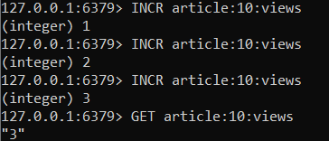
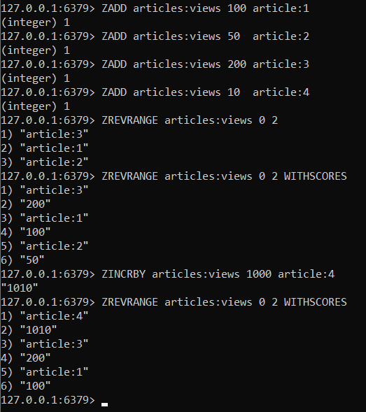
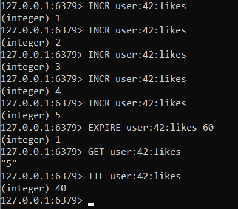

# Домашнее задание "Redis / Valkey"

## Часть 1. Запуск Redis

### 1. Запуск Redis через Docker

В PowerShell выполнена команда:

```powershell
docker run -d --name redis-stack -p 6379:6379 redis:latest
```

Docker скачал образ `redis:latest` и запустил контейнер с именем `redis-stack`, пробросив порт 6379.

### 2. Подключение к Redis CLI

```powershell
docker exec -it redis-stack redis-cli
```

После этого открылась интерактивная консоль Redis с приглашением `127.0.0.1:6379>`.

---

## Часть 2. Счётчик просмотров

Создан счётчик для статьи `article:10:views`. Каждый просмотр увеличивает счётчик командой `INCR`.

Выполнено:

```redis
INCR article:10:views   # 1
INCR article:10:views   # 2
INCR article:10:views   # 3
```

Получение текущего значения:

```redis
GET article:10:views
```

**Результат**: `"3"`



---

## Часть 3. Рейтинг статей

Создан Sorted Set с именем `articles:views` для leaderboard статей.

### Добавление статей с разным количеством просмотров

```redis
ZADD articles:views 100 article:1
ZADD articles:views 50  article:2
ZADD articles:views 200 article:3
ZADD articles:views 10  article:4
```

### Получение топ-3 статей **без** количества просмотров

```redis
ZREVRANGE articles:views 0 2
```

**Вывод**:
```
1) "article:3"
2) "article:1"
3) "article:2"
```

### Получение топ-3 статей **с** количеством просмотров

```redis
ZREVRANGE articles:views 0 2 WITHSCORES
```

**Вывод**:
```
1) "article:3"
2) "200"
3) "article:1"
4) "100"
5) "article:2"
6) "50"
```

### Добавление большого количества просмотров статье `article:4`

```redis
ZINCRBY articles:views 1000 article:4
```

Результат: `"1010"` (было 10, стало 1010).

### Новый топ-3

```redis
ZREVRANGE articles:views 0 2 WITHSCORES
```

**Вывод**:
```
1) "article:4"
2) "1010"
3) "article:3"
4) "200"
5) "article:1"
6) "100"
```



---

## Часть 4. Ограничение действий пользователя (Rate Limiting)

Пользователь с ID = 42 может поставить максимум 5 лайков за минуту. Счётчик лайков увеличивается командой `INCR`.

### Увеличение счётчика 5 раз

```redis
INCR user:42:likes
INCR user:42:likes
INCR user:42:likes
INCR user:42:likes
INCR user:42:likes
```

### Установка TTL = 60 секунд

```redis
EXPIRE user:42:likes 60
```

### Проверка текущего значения

```redis
GET user:42:likes
```

**Результат**: `"5"`

### Проверка времени до удаления ключа

```redis
TTL user:42:likes
```

**Результат**: `40` (секунд) 




