## 1. Нарисовать архитектуру

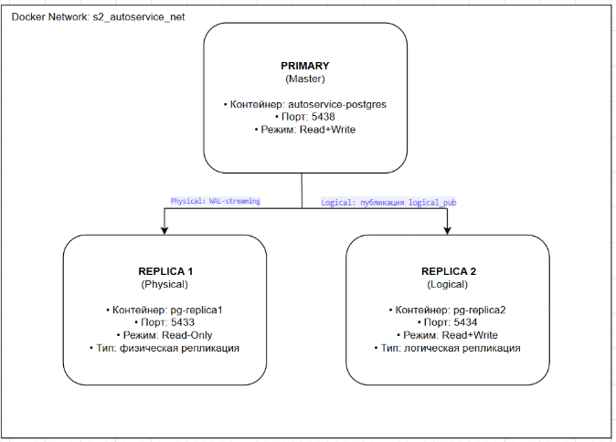
  
  
## 2. Настроить потоковую репликацию
Изменила **docker-compose.yml** и запустила контейнеры:
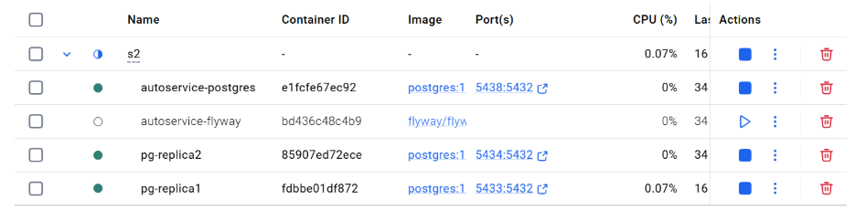

Создала пользователя репликации:
```sql
CREATE ROLE replicator WITH REPLICATION LOGIN PASSWORD 'replica_pass';
```
Настройка pg_hba.conf:
```
docker exec -it autoservice-postgres bash -c "
    echo 'host replication replicator 0.0.0.0/0 md5' >> /var/lib/postgresql/data/pg_hba.conf
    echo 'host all all 0.0.0.0/0 md5' >> /var/lib/postgresql/data/pg_hba.conf
"
```

Инициализация реплики и выполнение pg_basebackup:
```
docker exec -it pg-replica1 pg_basebackup `
    -h autoservice-postgres `
    -p 5432 `
    -D /var/lib/postgresql/data `
    -U replicator `
    -P `
    -R `
    -X stream `
    -C `
    -S replica1_slot
```

Проверка статуса репликации:
```sql
SELECT 
    pid,
    application_name,
    client_addr,
    state,
    sync_state,
    replay_lag
FROM pg_stat_replication;
```
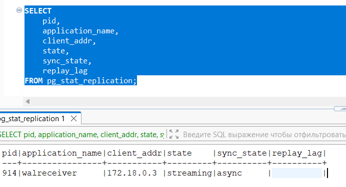

Статус **streaming** подтверждает успешную настройку физической репликации


## 3. Проверка репликации данных
### Вставить данные на master
```sql
INSERT INTO client (full_name, phone_number) 
VALUES ('Test Physical Replication', '+79991234567');
```

### Проверить наличие строки на реплике
```sql
SELECT * FROM client WHERE full_name = 'Test Physical Replication';
```
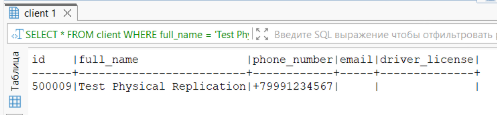

### Что произойдет если попробовать вставить данные на реплике
```sql
INSERT INTO client (full_name, phone_number) 
VALUES ('Try Write on Replica', '+79991234568');
```
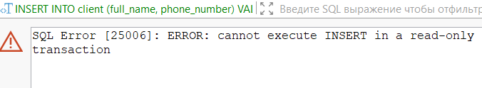

Вставка невозможна. Ошибка выполнения транзакции. Физическая реплика — это побайтовая копия мастера, находящаяся в режиме восстановления (hot_standby=on). Она предназначена только для чтения.


## 4. Анализ replication lag
### Создать нагрузку INSERT
```sql
INSERT INTO client (full_name, phone_number)
SELECT 
    'LoadTest_' || g || '_' || to_char(now(), 'HH24MISS'),
    '+7999' || floor(random() * 9000000 + 1000000)::text
FROM generate_series(1, 800) AS g;
```

### Наблюдать lag
Создала таблицу для логирования:
```sql
CREATE TABLE replication_lag_log (
    id SERIAL PRIMARY KEY,
    check_time TIMESTAMP DEFAULT NOW(),
    replica_name VARCHAR(100),
    state VARCHAR(50),
    sync_state VARCHAR(50),
    lag_bytes BIGINT,
    lag_pretty TEXT,
    replay_lag_sec NUMERIC,
    write_lag_sec NUMERIC,
    flush_lag_sec NUMERIC,
    lag_status VARCHAR(20)
);
```

Функция для записи и её запуск:
```sql
CREATE OR REPLACE FUNCTION collect_lag_data(
    iterations INT DEFAULT 30,
    delay_sec INT DEFAULT 2
)
RETURNS void AS $$
DECLARE
    i INT;
BEGIN
    FOR i IN 1..iterations LOOP
        INSERT INTO replication_lag_log (
            replica_name, state, sync_state, lag_bytes, lag_pretty,
            replay_lag_sec, write_lag_sec, flush_lag_sec, lag_status
        )
        SELECT 
            application_name,
            state,
            sync_state,
            pg_wal_lsn_diff(pg_current_wal_lsn(), replay_lsn),
            pg_size_pretty(pg_wal_lsn_diff(pg_current_wal_lsn(), replay_lsn)),
            COALESCE(EXTRACT(EPOCH FROM replay_lag), 0),
            COALESCE(EXTRACT(EPOCH FROM write_lag), 0),
            COALESCE(EXTRACT(EPOCH FROM flush_lag), 0),
            CASE 
                WHEN replay_lag IS NULL THEN 'No lag'
                WHEN replay_lag < interval '1 second' THEN 'Good'
                WHEN replay_lag < interval '5 seconds' THEN 'Warning'
                ELSE 'Critical'
            END
        FROM pg_stat_replication
        WHERE state = 'streaming';
        
        -- Задержка между замерами
        PERFORM pg_sleep(delay_sec);
    END LOOP;
END;
$$ LANGUAGE plpgsql;

SELECT collect_lag_data(30, 2);
```

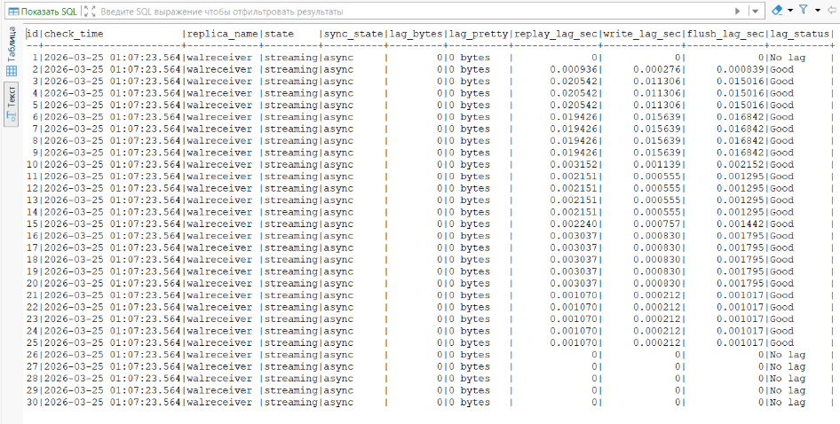

Было выполнено 30 замеров параметров репликации. Все измерения показали:

- lag_bytes = 0 bytes — реплика полностью синхронизирована по объёму данных с мастером
- replay_lag: от 0 до 0.025 сек (максимальная задержка применения записей)
- write_lag: от 0 до 0.016 сек (задержка записи WAL на диск)
- flush_lag: от 0 до 0.017 сек (задержка синхронизации на диск)
- Статус: streaming (активное подключение)
- Режим: async (асинхронная репликация)
**Вывод:** Физическая потоковая репликация работает корректно и стабильно. Реплика находится в режиме streaming и успешно синхронизируется с мастером. Несмотря на асинхронный режим репликации, задержки минимальны (не превышают 25 мс), что обеспечивает почти мгновенную синхронизацию данных.


## 5. Настроить Logical replication 
Publication на мастере:
```sql
CREATE TABLE test_logical (
    id SERIAL PRIMARY KEY,
    product_name VARCHAR(200),
    price INTEGER,
    updated_at TIMESTAMP DEFAULT NOW()
);

-- Создаем публикацию
CREATE PUBLICATION logical_pub FOR TABLE test_logical;

-- Проверка
SELECT * FROM pg_publication_tables;
```
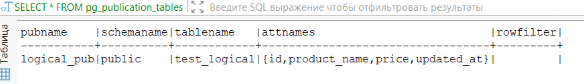

Subscription на Replica2:
```sql
CREATE TABLE test_logical (
    id SERIAL PRIMARY KEY,
    product_name VARCHAR(200),
    price INTEGER,
    updated_at TIMESTAMP DEFAULT NOW()
);

-- Создаем подписку
CREATE SUBSCRIPTION logical_sub
CONNECTION 'host=autoservice-postgres port=5432 dbname=autoservice user=replicator password=replica_pass'
PUBLICATION logical_pub;

-- Проверка статуса
SELECT * FROM pg_stat_subscription;
```
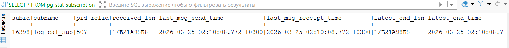

### Данные реплицируются
```sql
-- Мастер 
INSERT INTO test_logical (product_name, price) 
VALUES ('Масло моторное', 2500),
       ('Фильтр воздушный', 800);

-- Replica2 
SELECT * FROM test_logical;
```
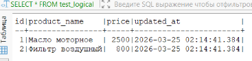

### DDL не реплицируется
```sql
-- Мастер 
ALTER TABLE test_logical ADD COLUMN description TEXT;

-- Мастер 
INSERT INTO test_logical (product_name, price, description) 
VALUES ('Тормозные колодки', 3200, 'Набор передних');

-- Replica2 
SELECT column_name
FROM information_schema.columns 
WHERE table_name = 'test_logical';

-- Replica2 
SELECT * FROM test_logical;
```

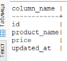
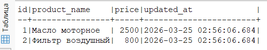

### Проверка REPLICA IDENTITY 
Создаем таблицу без первичного ключа:
```sql
-- Мастер 
CREATE TABLE test_no_pk (
    item_name VARCHAR(100),
    quantity INTEGER
);

ALTER PUBLICATION logical_pub ADD TABLE test_no_pk;

INSERT INTO test_no_pk (item_name, quantity) 
VALUES ('Болт М8', 50);

SELECT * FROM test_no_pk;
```
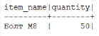

Создаем такую же таблицу на реплике:
```sql
-- Replica2 
CREATE TABLE test_no_pk (
    item_name VARCHAR(100),
    quantity INTEGER
);

-- Проверка
SELECT * FROM test_no_pk;
```
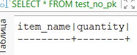

Пытаюсь сделать апдейт:
```sql
-- Мастер 
UPDATE test_no_pk SET quantity = 100 WHERE item_name = 'Болт М8';
```
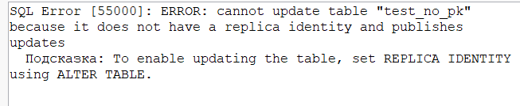

### Проверка replication status
Physical replication (на мастере):
```sql
SELECT 
    pid,
    application_name,
    client_addr,
    state,
    sync_state,
    replay_lag
FROM pg_stat_replication;
```
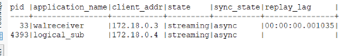

 Logical replication (на Replica2):
```sql
SELECT 
    subname,
    CASE 
        WHEN pid IS NULL THEN 'Not running' 
        ELSE 'Running' 
    END AS worker_status,
    received_lsn,
    latest_end_lsn,
    latest_end_time
FROM pg_stat_subscription;
```
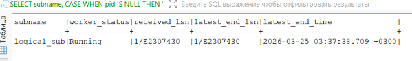

### Как могут пригодится pg_dump/pg_restore для данного вида репликации
Для логической репликации **pg_dump/pg_restore** полезны в следующих случаях:

- Синхронизация схемы: Так как DDL не реплицируется, можно выгрузить структуру таблиц с мастера и развернуть на подписчике для гарантированного совпадения структур.
- Начальная синхронизация: Для больших таблиц быстрее предварительно залить данные через pg_restore, чем ждать полной копии через механизм репликации.
- Восстановление: При рассинхронизации или повреждении данных на подписчике можно быстро восстановить состояние из дампа и продолжить репликацию изменений.


