## 1. Посмотреть на изменение LSN и WAL после изменения данных
### a. Сравнение LSN до и после INSERT
До INSERT:
```sql
SELECT 'CURRENT WAL POSITION' as stage, 
       pg_current_wal_insert_lsn() as lsn_before;
```
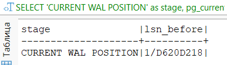

Добавляем данные:
```sql
INSERT INTO client (full_name, phone_number, email, driver_license)
VALUES (
    'Иванов Петр Сидорович',
    '+79991112233',
    'ivanov.ps@example.com',
    '77AB123456'
);
```

После INSERT:
```sql
SELECT 'AFTER INSERT' as stage,
       pg_current_wal_insert_lsn() as lsn_after;
```
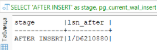

### b. Сравнение WAL до и после commit
До commit:
```sql
SELECT 
    'ДО COMMIT' as момент,
    pg_current_wal_insert_lsn() as lsn,
    pg_walfile_name(pg_current_wal_insert_lsn()) as wal_файл,
    pg_size_pretty((pg_current_wal_insert_lsn() - '0/0'::pg_lsn)::bigint) as всего_wal
```
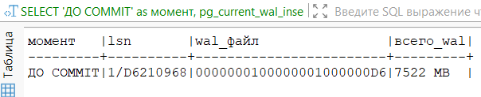

Транзакция:
```sql
BEGIN;
INSERT INTO client (full_name, phone_number, email, driver_license)
VALUES (
    'Простой тест',
    '+79991112233',
    'simple@test.com',
    'SIMPLE123'
);
COMMIT;
```

После commit:
```sql
SELECT 
    'ПОСЛЕ COMMIT' as момент,
    pg_current_wal_insert_lsn() as lsn,
    pg_walfile_name(pg_current_wal_insert_lsn()) as wal_файл,
    pg_size_pretty((pg_current_wal_insert_lsn() - '0/0'::pg_lsn)::bigint) as всего_wal
```
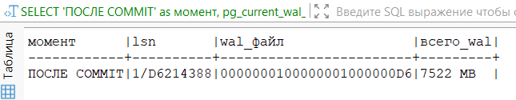

**Вывод:** Зафиксированы значения LSN до и после выполнения COMMIT: до COMMIT — 1/D6210968, после COMMIT — 1/D6214388. Разница составила 13 344 байта. При этом WAL файл остался тем же — 0000000100000001000000D6, а общий размер WAL (7522 MB) визуально не изменился из-за незначительности добавленного объема. Полученная разница включает как данные самой операции INSERT, так и служебные записи COMMIT. Механизм WAL обеспечивает надежность транзакций с минимальными накладными расходами — COMMIT добавляет лишь небольшую служебную информацию в журнал, не требуя создания нового WAL файла.

### c. Анализ WAL размера после массовой операции
Создаем новую тестовую таблицу:
```sql
CREATE TABLE wal_test (
    id serial PRIMARY KEY,
    data text,
    number_value integer,
    created_at timestamptz DEFAULT now()
);
```
Проверяем что таблица пустая:
```sql
SELECT 
    'Размер таблицы' as параметр,
    pg_size_pretty(pg_relation_size('wal_test')) as размер;
```
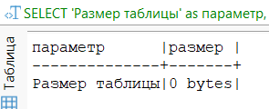

До массовой вставки данных следующие значения:
```sql
SELECT 
    'НАЧАЛО ЭКСПЕРИМЕНТА' as этап,
    pg_current_wal_insert_lsn() as lsn_start,
    pg_walfile_name(pg_current_wal_insert_lsn()) as wal_file,
    (SELECT count(*) FROM pg_ls_waldir()) as files_count,
    (SELECT pg_size_pretty(sum(size)) FROM pg_ls_waldir()) as total_wal_size;
```
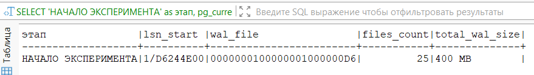

Вставляем данные:
```sql
DO $$
DECLARE
    records_count integer := 10000;
    start_lsn pg_lsn;
    end_lsn pg_lsn;
    start_time timestamptz;
    end_time timestamptz;
    bytes_generated bigint;
BEGIN
    -- Засекаем время и LSN
    start_time := clock_timestamp();
    start_lsn := pg_current_wal_insert_lsn();
    
    -- Массовая вставка
    INSERT INTO wal_test (data, number_value)
    SELECT 
        'Тестовые данные #' || gs,
        floor(random() * 1000000)
    FROM generate_series(1, records_count) gs;
    
    -- Фиксируем результаты
    end_lsn := pg_current_wal_insert_lsn();
    end_time := clock_timestamp();
    bytes_generated := end_lsn - start_lsn;
    
    -- Выводим результаты
    RAISE NOTICE 'РЕЗУЛЬТАТЫ МАССОВОЙ ВСТАВКИ';
    RAISE NOTICE 'Вставлено записей: %', records_count;
    RAISE NOTICE 'Время выполнения: % секунд', 
        EXTRACT(epoch FROM end_time - start_time);
    RAISE NOTICE 'LSN начало: %', start_lsn;
    RAISE NOTICE 'LSN конец:  %', end_lsn;
    RAISE NOTICE 'WAL сгенерировано: % KB', round(bytes_generated / 1024.0, 2);
END $$;
```
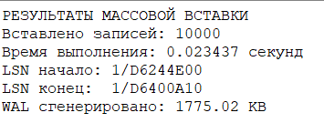

После массовой вставки данных:
```sql
SELECT 
    'КОНЕЦ ЭКСПЕРИМЕНТА' as этап,
    pg_current_wal_insert_lsn() as lsn_end,
    pg_walfile_name(pg_current_wal_insert_lsn()) as wal_file,
    (SELECT count(*) FROM pg_ls_waldir()) as files_count,
    (SELECT pg_size_pretty(sum(size)) FROM pg_ls_waldir()) as total_wal_size;
```
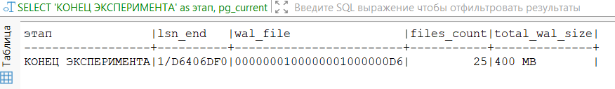

Размер таблицы теперь:
```sql
SELECT 
    'Размер таблицы' as параметр,
    pg_size_pretty(pg_relation_size('wal_test')) as размер,
    pg_size_pretty(pg_total_relation_size('wal_test')) as полный_размер_с_индексами;
```
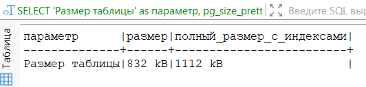

**Вывод:** Зафиксированы следующие результаты: LSN до операции — 1/D6244E00, LSN после операции — 1/D6400A10, разница составила 1 775.02 KB сгенерированного WAL. Количество WAL файлов и общий размер WAL (400 MB) визуально не изменились, так как прирост в 1.77 MB незначителен на фоне общего объема.
  
## 2. Сделать дамп БД и накатить его на новую чистую БД
### Dump только структуры базы
```powershell
docker exec -i autoservice-postgres bash -c "pg_dump -U admin -s autoservice > /tmp/autoservice_structure.sql"
```
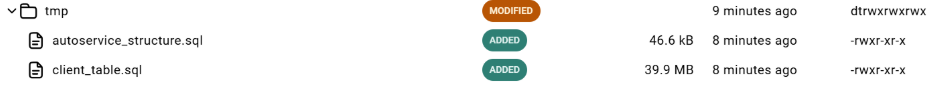

### Dump одной таблицы
```powershell
docker exec -i autoservice-postgres bash -c "pg_dump -U admin -t client autoservice > /tmp/client_table.sql"
```


Создаем новую бд:

```powershell
docker exec -i autoservice-postgres psql -U admin -d postgres -c "CREATE DATABASE autoservice_new;"
```

Накатываем структуру на новую бд из дампа:
```powershell
docker exec -i autoservice-postgres psql -U admin -d autoservice_new -f /tmp/autoservice_structure.sql
```
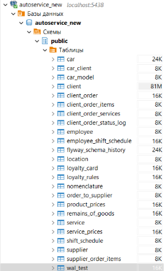
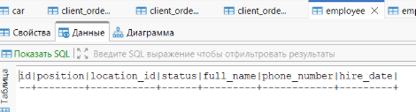

Накатываем таблицу клиентов на новую бд из дампа:
```powershell
docker exec -i autoservice-postgres psql -U admin -d autoservice_new -f /tmp/client_table.sql
```
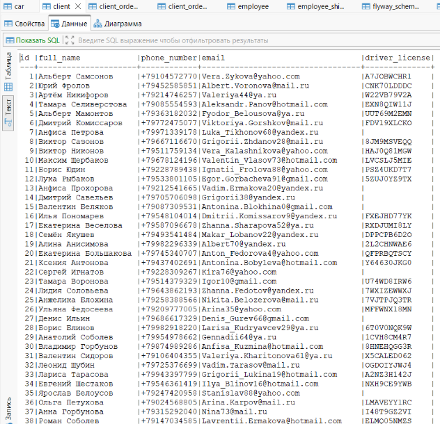


## 3. Создать несколько seed
### 1. Добавление тестовых данных
Тестовых поставщиков специально добавляем без **ON CONFLICT**, чтобы показать как работает идемпотентность:
```sql
-- 1. Тстовые клиенты
INSERT INTO client (full_name, phone_number, email, driver_license) 
VALUES
    ('Иванов Петр', '+79991112233', 'ivanov@test.com', 'TEST111'),
    ('Петрова Анна', '+79992223344', 'petrova@test.com', 'TEST222'),
    ('Сидоров Михаил', '+79993334455', 'sidorov@test.com', 'TEST333')
ON CONFLICT (driver_license) DO NOTHING;

-- 2. Тестовые услуги
INSERT INTO service (name, base_price, lead_time) 
VALUES
    ('Замена масла', 2500, 60),
    ('Диагностика', 3000, 120),
    ('Шиномонтаж', 2000, 45)
ON CONFLICT (name) DO NOTHING;

-- 3. Тестовые поставщики (без ON CONFLICT - для демонстрации проблемы)
INSERT INTO supplier (company_name, phone_number, email, bank_account) 
VALUES ('ООО Автозапчасти', '+74951112233', 'info@auto.ru', '12345678901');

-- 4. Проверка
SELECT 'client' as table_name, COUNT(*) FROM client WHERE driver_license LIKE 'TEST%'
UNION ALL
SELECT 'service', COUNT(*) FROM service WHERE name LIKE 'Замена%' OR name LIKE 'Диагностика%';
```
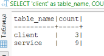

Создаем таблицу, чтобы запомнить количество данных:
```sql
CREATE TEMP TABLE before_counts AS
SELECT 'client' as tbl, COUNT(*) as cnt FROM client WHERE driver_license LIKE 'TEST%'
UNION ALL
SELECT 'service', COUNT(*) FROM service WHERE name LIKE 'Замена%' OR name LIKE 'Диагностика%'
UNION ALL
SELECT 'supplier', COUNT(*) FROM supplier WHERE company_name = 'ООО Автозапчасти';
```

### 2. Проверка идемпотентности seed (ON CONFLICT и др)
Запускаем seed повторно:
```sql
INSERT INTO client (full_name, phone_number, email, driver_license) 
VALUES
    ('Иванов Петр', '+79991112233', 'ivanov@test.com', 'TEST111'),
    ('Петрова Анна', '+79992223344', 'petrova@test.com', 'TEST222'),
    ('Сидоров Михаил', '+79993334455', 'sidorov@test.com', 'TEST333')
ON CONFLICT (driver_license) DO NOTHING;

INSERT INTO service (name, base_price, lead_time) 
VALUES
    ('Замена масла', 2500, 60),
    ('Диагностика', 3000, 120),
    ('Шиномонтаж', 2000, 45)
ON CONFLICT (name) DO NOTHING;

INSERT INTO supplier (company_name, phone_number, email, bank_account) 
VALUES ('ООО Автозапчасти', '+74951112233', 'info@auto.ru', '12345678901');
```

Сравниваем данные:
```sql
WITH after_counts AS (
    SELECT 'client' as tbl, COUNT(*) as cnt FROM client WHERE driver_license LIKE 'TEST%'
    UNION ALL
    SELECT 'service', COUNT(*) FROM service WHERE name LIKE 'Замена%' OR name LIKE 'Диагностика%'
    UNION ALL
    SELECT 'supplier', COUNT(*) FROM supplier WHERE company_name = 'ООО Автозапчасти'
)
SELECT 
    b.tbl,
    b.cnt as before,
    a.cnt as after,
    a.cnt - b.cnt as diff,
    CASE 
	    WHEN a.cnt - b.cnt = 0 THEN 'Идемпотентно' ELSE 'Есть дубликаты' 
	END as status
FROM before_counts b
JOIN after_counts a ON b.tbl = a.tbl;
```
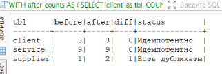

**Вывод:** использование **ON CONFLICT** гарантирует идемпотентность seed-скриптов. Таблицы, вставка в которые выполняется без проверки на уникальность, при повторном запуске создают дубликаты, что нарушает свойство идемпотентности. Для корректной работы seed-данных необходимо для каждой таблицы определить уникальное ограничение и использовать ON CONFLICT.


