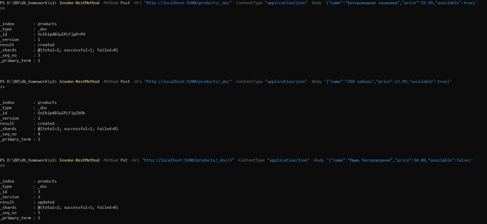
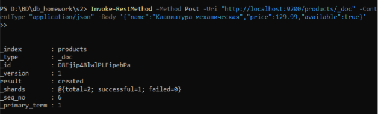
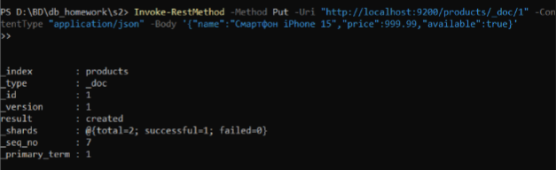
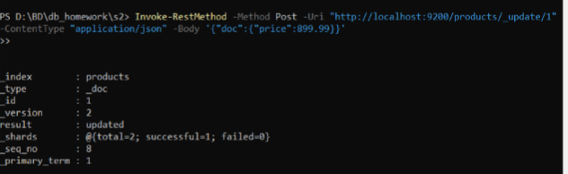
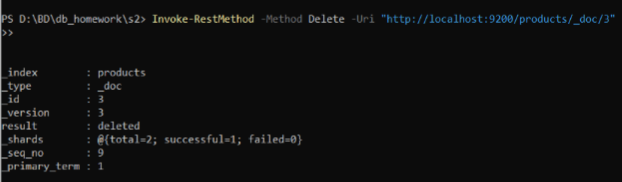
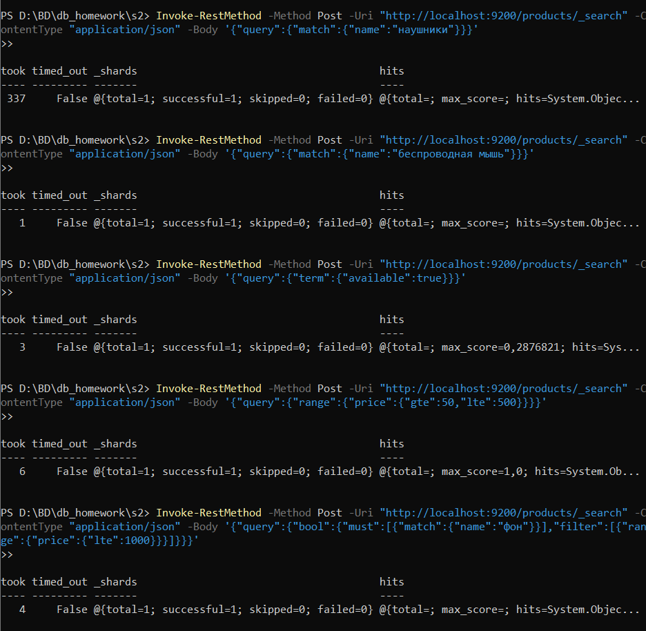

# Домашнее задание "Elasticsearch"

## 1. Запуск Elasticsearch в Docker

Использована команда:
```bash
docker run -d --name elasticsearch -p 9200:9200 -e "discovery.type=single-node" elasticsearch:7.17.22
```
Elasticsearch успешно запущен и отвечает.

---

## 2. Создание индекса `products`

Команда:
```powershell
curl.exe -X PUT "localhost:9200/products"
```
---

## 3. Заполнение индекса тестовыми данными

### Добавление документа с автоматическим ID (POST)
**Товар 1:**
```powershell
Invoke-RestMethod -Method Post -Uri "http://localhost:9200/products/_doc" -ContentType "application/json" -Body '{"name":"Беспроводные наушники","price":59.99,"available":true}'
```

**Товар 2:**
```powershell
Invoke-RestMethod -Method Post -Uri "http://localhost:9200/products/_doc" -ContentType "application/json" -Body '{"name":"USB кабель","price":12.99,"available":true}'
```

### Добавление документа с указанным ID (PUT)
**Товар 3 (id=3):**
```powershell
Invoke-RestMethod -Method Put -Uri "http://localhost:9200/products/_doc/3" -ContentType "application/json" -Body '{"name":"Мышь беспроводная","price":94.08,"available":false}'
```


Индекс заполнен тестовыми данными.

---

## 4. Операции с документами

### 4.1 Создать документ (без указания ID)
```powershell
Invoke-RestMethod -Method Post -Uri "http://localhost:9200/products/_doc" -ContentType "application/json" -Body '{"name":"Клавиатура механическая","price":129.99,"available":true}'
```
Результат:



### 4.2 Добавить документ с указанным id=1
```powershell
Invoke-RestMethod -Method Put -Uri "http://localhost:9200/products/_doc/1" -ContentType "application/json" -Body '{"name":"Смартфон iPhone 15","price":999.99,"available":true}'
```
Результат:



### 4.3 Обновить документ (id=1) – изменить цену
```powershell
Invoke-RestMethod -Method Post -Uri "http://localhost:9200/products/_update/1" -ContentType "application/json" -Body '{"doc":{"price":899.99}}'
```
Результат:



### 4.4 Удалить документ (id=3)
```powershell
Invoke-RestMethod -Method Delete -Uri "http://localhost:9200/products/_doc/3"
```
Результат (скриншот №5):


Все CRUD-операции выполнены успешно.

---

## 5. Поисковые запросы

> Примечание: в PowerShell для GET с телом возникает ошибка, поэтому используется `-Method Post`.

### 5.1 Поиск по названию товара (слово "наушники")
```powershell
Invoke-RestMethod -Method Post -Uri "http://localhost:9200/products/_search" -ContentType "application/json" -Body '{"query":{"match":{"name":"наушники"}}}'
```
Найден товар "Беспроводные наушники".

### 5.2 Запрос с `match` ("беспроводная мышь")
```powershell
Invoke-RestMethod -Method Post -Uri "http://localhost:9200/products/_search" -ContentType "application/json" -Body '{"query":{"match":{"name":"беспроводная мышь"}}}'
```
Match работает.

### 5.3 Запрос с `term` (available = true)
```powershell
Invoke-RestMethod -Method Post -Uri "http://localhost:9200/products/_search" -ContentType "application/json" -Body '{"query":{"term":{"available":true}}}'
```
Term находит точное совпадение.

### 5.4 Запрос с `range` (цена от 50 до 500)
```powershell
Invoke-RestMethod -Method Post -Uri "http://localhost:9200/products/_search" -ContentType "application/json" -Body '{"query":{"range":{"price":{"gte":50,"lte":500}}}}'
```
Range правильно фильтрует.

### 5.5 Запрос с `bool` (match "фон" + filter price ≤ 1000)
```powershell
Invoke-RestMethod -Method Post -Uri "http://localhost:9200/products/_search" -ContentType "application/json" -Body '{"query":{"bool":{"must":[{"match":{"name":"фон"}}],"filter":[{"range":{"price":{"lte":1000}}}]}}}'
```
Bool комбинирует условия.




